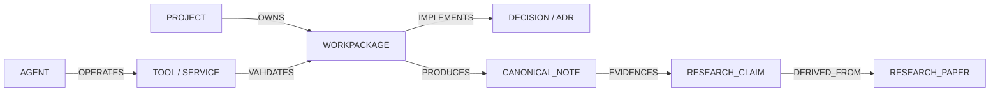

# Agentic Graph Architecture & Typed Topology Specification

## 1. Architectural Invariant: Epistemic Graph Grounding

In the KAD ecosystem, the graph is **not a speculative statistical graph**. It connects verified artifacts, specifications, execution receipts, research papers, and agent tools.

Crucially:
- **Canonical edges** (`EXPLICIT_CANONICAL`) are human-authored in YAML frontmatter or accepted ADRs.
- **Derived edges** (`DETERMINISTIC_DERIVED`) are deterministically compiled from code imports, wikilinks, and workctl task structures.
- **Heuristic suggestions** (`HEURISTIC_SUGGESTION`) are isolated and cannot masquerade as canonical facts.

---

## 2. Node & Edge Type Taxonomies



### A. Node Classification
1. `PROJECT`: Root and subprojects (`kad-pi`, `data_workspace`, `technopagan-netrunner`).
2. `WORKPACKAGE`: Execution items (`WP-001` .. `WP-012`).
3. `DECISION`: Architectural decision records (`ADR 0001` .. `ADR 0012`).
4. `CANONICAL_NOTE`: Governed knowledge notes in `vault/`.
5. `RESEARCH_PAPER`: Bibliographic sources in research corpus.
6. `RESEARCH_CLAIM`: Epistemically audited factual claims.
7. `AGENT`: Declared agent roles (`kad-master`, `scout`, `librarian`).
8. `TOOL` / `SERVICE`: Executable tools (`workctl`, `kad`, `kad-wiki`) and daemons.
9. `MODEL`: Foundation and local models (`gemini-3.7-flash`, `stheno-13b`).
10. `PROJECTION`: Derived read-only compiled views (`graph.json`, `projects.json`).

### B. Typed Edge Taxonomy
- `DEPENDS_ON`: Functional or execution requirement.
- `DERIVED_FROM`: Provenance/projection lineage.
- `PRODUCES`: Tool/WP creates an artifact.
- `IMPLEMENTS`: Realization of an ADR or specification.
- `VALIDATES`: Test or gate verifying a component.
- `EVIDENCES`: Observation or receipt supporting a claim.
- `OWNS`: Subsystem or actor possessing authority over a domain.
- `BLOCKS`: Execution blocker between workpackages.
- `SUPERSEDES`: Replaces a legacy or deprecated artifact.
- `RELATES_TO`: Associative conceptual link (standard wikilink).

---

## 3. Interchange Schema (`kad-canonical-graph-v1`)

The canonical graph format exported by `tools/kad/wiki/projection.mjs`:
```json
{
  "schema": "kad-canonical-graph-v1",
  "source_vault_revision": "583f35eecbbc6f6eafbbc9dd98ecefebb3d6a197cb2bd47a1db1ba22c9be47a8",
  "generated_at": "2026-08-30T08:00:00.000Z",
  "nodes": [
    {
      "id": "kad-current-architecture",
      "label": "Current Architecture",
      "type": "architecture",
      "authority": "CANONICAL_KNOWLEDGE",
      "epistemic_class": "PROJECT_INFERENCE",
      "path": "50_Projects/KAD-PI/Architecture/Current-Architecture.md"
    }
  ],
  "edges": [
    {
      "source": "kad-current-architecture",
      "target": "kad-pi-overview",
      "type": "RELATES_TO",
      "authority_class": "DETERMINISTIC_DERIVED"
    }
  ]
}
```

---

## 4. Multi-Surface Graph Consumption

1. **Sofia v3 Dashboard**: Consumes `graph.json` via Cytoscape.js for interactive topology navigation, neighborhood filtering, and dependency inspection.
2. **Obsidian Bridge Plugin**: Visualizes local 1-hop and 2-hop neighborhoods around the currently active note.
3. **OMP Agent Tooling**: Enables agents to query structural relationships (`find upstream blockers of WP-X`, `inspect ADRs implementing PON`).
