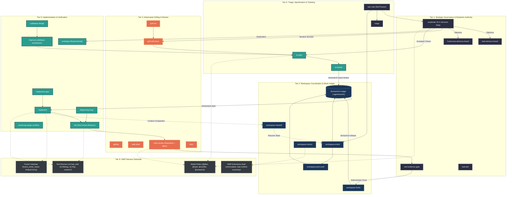

# KAD-PI Skills Architecture, Tool Invocations, and OMP Harness Interaction Graph

* **Document Identifier**: `KAD-ARCH-SKILLS-OMP-GRAPH-001`
* **Authority**: Wayfinder + KAD Epistemic Evidence Gate
* **Fixed Point**: Git HEAD / Workspace State (2026-08-30)
* **Epistemic Classification**:
  - `[CONFIRMED_PRIMARY]`: Direct verification from local source files, configs, and lockfiles.
  - `[DERIVED_STRUCTURAL]`: Computed topology, call-graph analysis, and data-flow synthesis.
  - `[OBSERVED_STATE]`: Live runtime telemetry, registered commands, and OMP harness bindings.
* **Canonical Storage Locations**:
  - `docs/architecture/KAD_PI_SKILLS_AND_OMP_HARNESS_INTERACTION_GRAPH.md`
  - `evidence/WP-KAD-SKILL-INTERACTION-GRAPH-RESEARCH/FINAL_REPORT.md`

---

## 1. Executive Summary & Epistemic Legend

The KAD-PI agentic architecture is structured around a strict separation between **cognitive guidance (Skills)**, **deterministic authority and state management (`workctl`, `make verify`, deterministic gates)**, and **transport/execution substrates (Oh My Pi / OMP Harness)**.

### Core Architectural Invariants:
1. **KAD Authority Outranks OMP Conventions**: OMP semantic roles only bind the final model transport; OMP is never the economic, epistemic, or trust authority (`.omp/AGENTS.md`).
2. **Deterministic-First Execution**: State transitions, ticket registration, claim allocation, handoffs, and verification are 100% deterministic programs (`bin/workctl`, `bin/kad-*`). Model judgment never mutates execution state out-of-band (`docs/adr/0011-omp-agentic-toolchain-and-extension-architecture.md`).
3. **Zero-Model Work Ledger**: No model, provider, or harness identity is permitted in a work contract (`.agents/work/*.json`).
4. **Human Decision Gate**: Wayfinder and Advisory Boards structure choices into $5 + 1$ options (`ask_user`); advisors recommend, but never authorize (`docs/agents/kad-matt-workflow.md`).
5. **Epistemic Provenance**: Research and local model outputs are evidence inputs, never decision authorities.

---

## 2. Multi-Tier Architecture Overview

```text
┌────────────────────────────────────────────────────────────────────────────────────────┐
│                        TIER 1: HUMAN & EPISTEMIC GOVERNANCE                            │
│  [Human Operator] ──(ask_user: 5+1)──> [Wayfinder] ──> [Advisory Boards / Evidence]   │
└──────────────────────────────────────────┬─────────────────────────────────────────────┘
                                           │ (Selected Option: AUTHOR_DECLARED)
┌──────────────────────────────────────────▼─────────────────────────────────────────────┐
│                    TIER 2: WORKSPACE COORDINATION & LEDGER LIFECYCLE                   │
│   [to-spec] ──> [to-tickets] ──> [workctl import] ──> [workctl claim] ──> [workctl]   │
└──────────────────────────────────────────┬─────────────────────────────────────────────┘
                                           │ (Claim: Mutating Lease Acquired)
┌──────────────────────────────────────────▼─────────────────────────────────────────────┐
│                 TIER 3: COGNITIVE GUIDANCE & ENGINEERING EXECUTION                     │
│  [implement] ──> [tdd] ──> [code-review] ──> [kad-evidence-gate] ──> [workspace-finish] │
└──────────────────────────────────────────┬─────────────────────────────────────────────┘
                                           │ (Tool Invocations & Subagent Spawns)
┌──────────────────────────────────────────▼─────────────────────────────────────────────┐
│                          TIER 4: OMP HARNESS SUBSTRATE                                 │
│  • Model Roles: @plan, @task, @verifier, @research, @smol, @world, @local_retrieval    │
│  • Extensions: kad-control-plane (telemetry meter), kad-context-economy (checkpoints) │
│  • Fusion Harness: fusion_writer_lease mutation gateway (default deny)                 │
│  • Tool Devices: xd://kad_telemetry, xd://kad_policy_status, xd://lsp, xd://ast_edit   │
│  • MCP Servers: context7 (up-to-date framework & library documentation)                │
└────────────────────────────────────────────────────────────────────────────────────────┘
```

---

## 3. Comprehensive Skill Inventory & Deep Analysis

Total Registered & Global Skills Analyzed: **49** (46 project-scoped in `.agents/skills/`, 3 global in `~/.agents/skills/`).

### 1. Strategic Governance & Epistemic Authority

#### Skill: `wayfinder`

- **Category**: 1. Strategic Governance & Epistemic Authority
- **Local Mode / Checksum**: `VANILLA + KAD OVERLAY` | `3d336dde785d322c...`
- **Upstream Source**: `https://github.com/mattpocock/skills` (rev `6654f6b60cd9`)
- **File Location**: `.agents/skills/wayfinder/SKILL.md`
- **Description**: Plan a huge chunk of work (more than one agent session can hold) as a shared map of decision tickets on your issue tracker, and resolve them one at a time until the way to the destination is clear.
- **Operational Responsibility**: Central strategic decision and navigation router for complex engineering choices. Synthesizes codebase state, identifies architectural trade-offs, and presents exactly 5 structured options plus 1 custom write-in to the human operator via `ask_user`.
- **Activation Triggers**: When facing architectural forks, complex refactors, ambiguous requirements, or when entering a new project phase.
- **Invoked Tools & CLIs**: `ask` (mandatory 5+1 human decision protocol), `read` (codebase inspection), `task` (spawning investigative scouts), `workctl` (status check), `write` (decision maps).
- **Inputs & Outputs**: Input: Ambiguous state / architectural dilemma. Output: Structured Decision Map Markdown (`decision_map.md`) with human-selected `AUTHOR_DECLARED` choice.
- **DAG Transitions**: Upstream: Any blocked or exploratory state. Downstream: `to-spec`, `to-tickets`, `domain-modeling`, `prototype`, `research`, `5-persona-advisory-board`.
- **OMP Harness Integration**: Uses `@plan` model role (GPT-5.6-Luna / Gemini-3.7-Flash). Enforces strict human-in-the-loop gating before mutating actions.

#### Skill: `kad-advisory-board`

- **Category**: 1. Strategic Governance & Epistemic Authority
- **Local Mode / Checksum**: `NATIVE KAD` | `Local / Global...`
- **Upstream Source**: `KAD Native` (rev `Pinned / Loc`)
- **File Location**: `.agents/skills/kad-advisory-board/SKILL.md`
- **Description**: Stress-test high-impact KAD decisions through five evidence-based advisory lenses.
- **Operational Responsibility**: Adversarial stress-testing of high-impact KAD decisions through five evidence-based advisory lenses: Architecture, Security, Operational Economy, Correctness/Verification, and Epistemic Risk.
- **Activation Triggers**: High-impact architectural decisions, security boundary modifications, cross-project schema cutovers, or ADR finalization.
- **Invoked Tools & CLIs**: `ask` (human review), `read` (ADR/evidence inspection), `task` (parallel persona evaluation), `write` (advisory review records).
- **Inputs & Outputs**: Input: Draft ADR, architectural proposal, or workpackage contract. Output: Five-lens consensus/dissent review matrix.
- **DAG Transitions**: Upstream: `wayfinder`, `domain-modeling`. Downstream: `to-spec`, `kad-evidence-gate`.
- **OMP Harness Integration**: Spawns parallel advisor subagents via `task(tasks=[...])` using `@verifier` and `@research` roles.

#### Skill: `5-persona-advisory-board`

- **Category**: 1. Strategic Governance & Epistemic Authority
- **Local Mode / Checksum**: `VANILLA` | `77e4fed9484881c5...`
- **Upstream Source**: `https://github.com/harryvondiesel-web/5-persona-advisory-board` (rev `fd58b80648c3`)
- **File Location**: `.agents/skills/5-persona-advisory-board/SKILL.md`
- **Description**: Run a 5 Persona Advisory Board review, board review, strategic decision stress-test, offer critique, risk check, or pricing/timing/positioning decision review.
- **Operational Responsibility**: Upstream-compatible 5-persona strategic stress test (Customer/User, Business/Economics, Technical Architect, Security/Risk, Operations/Maintainability).
- **Activation Triggers**: Strategic roadmap planning, major feature proposals, or pricing/timing decisions.
- **Invoked Tools & CLIs**: `ask`, `task`, `read`, `write`, `make`.
- **Inputs & Outputs**: Input: Strategic dilemma or design proposal. Output: Multi-persona critique document with confidence scoring.
- **DAG Transitions**: Upstream: `wayfinder`. Downstream: `to-spec`, `domain-modeling`.
- **OMP Harness Integration**: Parallelized subagent execution using OMP task harness.

#### Skill: `kad-evidence-gate`

- **Category**: 1. Strategic Governance & Epistemic Authority
- **Local Mode / Checksum**: `NATIVE KAD` | `Local / Global...`
- **Upstream Source**: `KAD Native` (rev `Pinned / Loc`)
- **File Location**: `.agents/skills/kad-evidence-gate/SKILL.md`
- **Description**: Use when turning an observed or proposed trajectory into reusable KAD knowledge, or when checking whether a candidate skill/policy may be promoted. Do not invoke for ordinary implementation without a distillation candidate.
- **Operational Responsibility**: Strict verification gate ensuring that candidate policies, skills, or state modifications possess complete, reproducible, deterministic evidence before promotion to permanent authority.
- **Activation Triggers**: Workpackage completion, skill promotion proposals, knowledge base additions, or ADR ratification.
- **Invoked Tools & CLIs**: `read` (evidence artifact inspection), `task` (independent verifier audit), `bin/workctl` (status check).
- **Inputs & Outputs**: Input: Evidence files (`evidence/<WP_ID>/*`). Output: Epistemic validation verdict (`PASS` / `FAIL`).
- **DAG Transitions**: Upstream: `code-review`, `tdd`, `implement`. Downstream: `workspace-finish`.
- **OMP Harness Integration**: Integrates with `@verifier` model role. Enforces KAD invariant that deterministic evidence outranks model judgment.

#### Skill: `kad-wiki`

- **Category**: 1. Strategic Governance & Epistemic Authority
- **Local Mode / Checksum**: `NATIVE KAD` | `Local / Global...`
- **Upstream Source**: `KAD Native` (rev `Pinned / Loc`)
- **File Location**: `.agents/skills/kad-wiki/SKILL.md`
- **Description**: Governed canonical Obsidian vault librarian workflow
- **Operational Responsibility**: Maintains and queries the KAD knowledge plane, synchronizing documentation, entity definitions, and architectural context with Obsidian vault projections.
- **Activation Triggers**: Knowledge discovery, architectural entity lookups, concept queries, or documentation synchronization.
- **Invoked Tools & CLIs**: `bin/kad-knowledge`, `bin/kad-wiki`, `read`, `write`.
- **Inputs & Outputs**: Input: Entity name or query. Output: Projected markdown notes and wikilink graph references.
- **DAG Transitions**: Upstream: `domain-modeling`, `research`. Downstream: `to-spec`, `implement`.
- **OMP Harness Integration**: Uses `tools/kad/wiki-projection.mjs` and `bin/kad-knowledge` deterministic lookup.

### 2. Workspace Coordination & Work Ledger Lifecycle

#### Skill: `workspace-orient`

- **Category**: 2. Workspace Coordination & Work Ledger Lifecycle
- **Local Mode / Checksum**: `NATIVE KAD` | `Local / Global...`
- **Upstream Source**: `KAD Native` (rev `Pinned / Loc`)
- **File Location**: `.agents/skills/workspace-orient/SKILL.md`
- **Description**: Orient an agent to the shared workspace, nearest project, governing instructions, and next safe deterministic action.
- **Operational Responsibility**: Zero-model deterministic workspace bootstrap and orientation. Identifies the active project, current claim, unblocked work frontier, and governing policies without model inference.
- **Activation Triggers**: Session start, post-compaction recovery, agent resumption, or context re-initialization.
- **Invoked Tools & CLIs**: `bin/workctl orient`, `bin/workctl bootstrap`, `bin/workctl status`, `bin/workctl doctor`, `read`.
- **Inputs & Outputs**: Input: Filesystem state. Output: Structured orientation JSON describing project root, claim status, and next unblocked work item.
- **DAG Transitions**: Upstream: Session bootstrap / fresh agent start. Downstream: `workspace-pick-work`, `wayfinder`.
- **OMP Harness Integration**: Executed at session initialization; hooks into `kad-context-economy` compaction recovery.

#### Skill: `workspace-pick-work`

- **Category**: 2. Workspace Coordination & Work Ledger Lifecycle
- **Local Mode / Checksum**: `NATIVE KAD` | `Local / Global...`
- **Upstream Source**: `KAD Native` (rev `Pinned / Loc`)
- **File Location**: `.agents/skills/workspace-pick-work/SKILL.md`
- **Description**: Select and claim the highest-priority unblocked READY work item using the shared deterministic ledger.
- **Operational Responsibility**: Deterministic selection and exclusive claiming of the highest-priority unblocked `READY` workpackage ticket from the ledger.
- **Activation Triggers**: When starting a new work item or transitioning between tickets.
- **Invoked Tools & CLIs**: `bin/workctl next`, `bin/workctl claim <ID>`, `bin/workctl show <ID>`, `read`.
- **Inputs & Outputs**: Input: Workspace work ledger (`.agents/work/*.json`). Output: Acquired claim file (`.agents/work/claims/<ID>.json`) and work context.
- **DAG Transitions**: Upstream: `workspace-orient`, `to-tickets`. Downstream: `implement`, `tdd`, `prototype`.
- **OMP Harness Integration**: Enforces mutating lease invariant before any source modification can occur.

#### Skill: `workspace-doctor`

- **Category**: 2. Workspace Coordination & Work Ledger Lifecycle
- **Local Mode / Checksum**: `NATIVE KAD` | `Local / Global...`
- **Upstream Source**: `KAD Native` (rev `Pinned / Loc`)
- **File Location**: `.agents/skills/workspace-doctor/SKILL.md`
- **Description**: Diagnose registry, skills, tools, work, claims, handoffs, and project entrypoints without model inference.
- **Operational Responsibility**: Runs comprehensive deterministic diagnostics across workspace registries, skill lockfiles, tool definitions, active claims, and git invariants.
- **Activation Triggers**: Workspace health checks, CI/CD validation, pre-release audits, or debugging state drift.
- **Invoked Tools & CLIs**: `bin/workctl doctor`, `bin/workctl skills --check`, `read`.
- **Inputs & Outputs**: Input: Workspace state. Output: Diagnostic report JSON with `PASS`/`FAIL` items and remedial actions.
- **DAG Transitions**: Upstream: Periodic or post-mutation. Downstream: `workspace-orient`, `workspace-finish`.
- **OMP Harness Integration**: Exposed via OMP slash command `/kad-doctor` and `tools/kad/telemetry/control-plane-runtime.mjs`.

#### Skill: `workspace-finish`

- **Category**: 2. Workspace Coordination & Work Ledger Lifecycle
- **Local Mode / Checksum**: `NATIVE KAD` | `Local / Global...`
- **Upstream Source**: `KAD Native` (rev `Pinned / Loc`)
- **File Location**: `.agents/skills/workspace-finish/SKILL.md`
- **Description**: Finish a claimed work item with project validation, review, evidence, and explicit state transition.
- **Operational Responsibility**: Closes an active workpackage claim with full deterministic verification, test receipts, code review sign-off, and state transition to `COMPLETED`.
- **Activation Triggers**: Workpackage implementation and testing complete.
- **Invoked Tools & CLIs**: `bin/workctl release <ID>`, `bin/workctl status`, `read`, `task` (verification run).
- **Inputs & Outputs**: Input: Active claim, verification evidence, review approval. Output: Completed workpackage status and released claim.
- **DAG Transitions**: Upstream: `kad-evidence-gate`, `code-review`, `tdd`. Downstream: `workspace-orient`, `workspace-pick-work`.
- **OMP Harness Integration**: Guarantees atomic release of the `fusion_writer_lease` and updates the control plane work state.

#### Skill: `workspace-handoff`

- **Category**: 2. Workspace Coordination & Work Ledger Lifecycle
- **Local Mode / Checksum**: `NATIVE KAD` | `Local / Global...`
- **Upstream Source**: `KAD Native` (rev `Pinned / Loc`)
- **File Location**: `.agents/skills/workspace-handoff/SKILL.md`
- **Description**: Record durable continuation state so another harness can resume work without conversation history.
- **Operational Responsibility**: Records durable continuation state (active claim, touched files, completed steps, blocker notes) so another agent or harness can seamlessly resume without conversation history.
- **Activation Triggers**: Context exhaustion, session termination, cross-harness handoff, or paused tasks.
- **Invoked Tools & CLIs**: `bin/workctl handoff <ID>`, `git status`, `git diff`, `write`.
- **Inputs & Outputs**: Input: In-progress work state. Output: Durable handoff artifact (`.agents/work/handoffs/<ID>.md` and `.json`).
- **DAG Transitions**: Upstream: `implement`, `diagnosing-bugs`. Downstream: `workspace-orient` (in resuming session).
- **OMP Harness Integration**: Works in synergy with `kad-context-economy` to persist checkpoints across compaction events.

#### Skill: `handoff`

- **Category**: 2. Workspace Coordination & Work Ledger Lifecycle
- **Local Mode / Checksum**: `LOCAL / VANILLA` | `Local / Global...`
- **Upstream Source**: `KAD Native` (rev `Pinned / Loc`)
- **File Location**: `.agents/skills/handoff/SKILL.md`
- **Description**: Compact the current conversation into a handoff document for another agent to pick up.
- **Operational Responsibility**: Generic conversation and state handoff generator for clean agent transitions.
- **Activation Triggers**: Session handoff or task delegation.
- **Invoked Tools & CLIs**: `write`.
- **Inputs & Outputs**: Input: Summary of progress. Output: Handoff markdown document.
- **DAG Transitions**: Upstream: Any active skill. Downstream: Resuming agent.
- **OMP Harness Integration**: Lightweight context transfer mechanism.

#### Skill: `claude-handoff`

- **Category**: 2. Workspace Coordination & Work Ledger Lifecycle
- **Local Mode / Checksum**: `LOCAL / VANILLA` | `Local / Global...`
- **Upstream Source**: `KAD Native` (rev `Pinned / Loc`)
- **File Location**: `.agents/skills/claude-handoff/SKILL.md`
- **Description**: Hand the current conversation off to a fresh background agent that picks up the work immediately.
- **Operational Responsibility**: Specialized handoff generator formatted for Claude Code background subagents.
- **Activation Triggers**: Handoff to Claude Code execution environment.
- **Invoked Tools & CLIs**: `write`.
- **Inputs & Outputs**: Input: Session context. Output: Claude Code-compatible handoff document.
- **DAG Transitions**: Upstream: Any active skill. Downstream: Claude Code subagent.
- **OMP Harness Integration**: Bridges OMP session state to external CLI subagents.

### 3. Strategic Triage, Specification & Ticketing

#### Skill: `ask-matt`

- **Category**: 3. Strategic Triage, Specification & Ticketing
- **Local Mode / Checksum**: `VANILLA + KAD OVERLAY` | `e7a579691c802811...`
- **Upstream Source**: `https://github.com/mattpocock/skills` (rev `6654f6b60cd9`)
- **File Location**: `.agents/skills/ask-matt/SKILL.md`
- **Description**: Ask which skill or flow fits your situation. A router over the skills in this repo.
- **Operational Responsibility**: Meta-skill router and workflow advisor that inspects the user's intent and recommends the optimal skill, sequence, or engineering discipline.
- **Activation Triggers**: User asks 'what should I do next?', 'which skill fits?', or presents an uncategorized problem.
- **Invoked Tools & CLIs**: `bin/workctl status`, `read`, `ask`.
- **Inputs & Outputs**: Input: User goal. Output: Recommended skill invocation path.
- **DAG Transitions**: Upstream: Initial interaction. Downstream: `wayfinder`, `triage`, `implement`, `diagnosing-bugs`, etc.
- **OMP Harness Integration**: Fast cognitive routing layer.

#### Skill: `triage`

- **Category**: 3. Strategic Triage, Specification & Ticketing
- **Local Mode / Checksum**: `VANILLA + CONFIG` | `57b46ed96577e4b4...`
- **Upstream Source**: `https://github.com/mattpocock/skills` (rev `6654f6b60cd9`)
- **File Location**: `.agents/skills/triage/SKILL.md`
- **Description**: Move issues and external PRs through a state machine of triage roles,
- **Operational Responsibility**: Triages bug reports, feature requests, or technical debt into structured categories, assessing severity, repro steps, and project ownership.
- **Activation Triggers**: Incoming issues, user bug reports, feature backlog grooming.
- **Invoked Tools & CLIs**: `read`, `write`, `ask`.
- **Inputs & Outputs**: Input: Raw issue text. Output: Triaged assessment with classification, impact, and proposed next step.
- **DAG Transitions**: Upstream: User prompt / issue arrival. Downstream: `to-spec`, `to-tickets`, `diagnosing-bugs`.
- **OMP Harness Integration**: Employs `@smol` or `@task` model roles.

#### Skill: `to-spec`

- **Category**: 3. Strategic Triage, Specification & Ticketing
- **Local Mode / Checksum**: `VANILLA + KAD OVERLAY` | `36e191088dd05407...`
- **Upstream Source**: `https://github.com/mattpocock/skills` (rev `6654f6b60cd9`)
- **File Location**: `.agents/skills/to-spec/SKILL.md`
- **Description**: 'Turn the current conversation into a spec and publish it to the project
- **Operational Responsibility**: Transforms an agreed architectural decision or feature proposal into a rigorous engineering specification with clear trust boundaries, evidence targets, and acceptance criteria.
- **Activation Triggers**: Post-Wayfinder decision acceptance; before workpackage ticketization.
- **Invoked Tools & CLIs**: `read`, `write`, `make`.
- **Inputs & Outputs**: Input: Decision map / proposal. Output: Engineering Specification Markdown (`SPEC.md` or ADR).
- **DAG Transitions**: Upstream: `wayfinder`, `grill-with-docs`. Downstream: `to-tickets`.
- **OMP Harness Integration**: High-reasoning synthesis using `@plan` role.

#### Skill: `to-tickets`

- **Category**: 3. Strategic Triage, Specification & Ticketing
- **Local Mode / Checksum**: `VANILLA + KAD OVERLAY` | `dff4b3b60c7ce7fa...`
- **Upstream Source**: `https://github.com/mattpocock/skills` (rev `6654f6b60cd9`)
- **File Location**: `.agents/skills/to-tickets/SKILL.md`
- **Description**: Break a plan, spec, or the current conversation into a set of tracer-bullet
- **Operational Responsibility**: Decomposes an accepted engineering specification into atomic, tracer-bullet workpackage tickets and imports them deterministically into `.agents/work/`.
- **Activation Triggers**: Completed specification ready for execution breakdown.
- **Invoked Tools & CLIs**: `bin/workctl import-tickets`, `bin/workctl next`, `read`, `write`, `edit`.
- **Inputs & Outputs**: Input: Specification. Output: Pinned ticket files (`.agents/work/WP-*.json`) registered in the ledger.
- **DAG Transitions**: Upstream: `to-spec`. Downstream: `workspace-pick-work`.
- **OMP Harness Integration**: Deterministic ticket import guarantees DAG acyclicity and dependency validation.

#### Skill: `to-questionnaire`

- **Category**: 3. Strategic Triage, Specification & Ticketing
- **Local Mode / Checksum**: `LOCAL / VANILLA` | `Local / Global...`
- **Upstream Source**: `KAD Native` (rev `Pinned / Loc`)
- **File Location**: `.agents/skills/to-questionnaire/SKILL.md`
- **Description**: Turn a decision you can't fully answer into a questionnaire for someone else to fill in.
- **Operational Responsibility**: Generates structured, multi-question diagnostic surveys to elicit requirements from stakeholders or domain experts.
- **Activation Triggers**: Requirement discovery, user preference gathering.
- **Invoked Tools & CLIs**: `ask`, `write`.
- **Inputs & Outputs**: Input: Problem area. Output: Formatted questionnaire Markdown.
- **DAG Transitions**: Upstream: `triage`. Downstream: `to-spec`.
- **OMP Harness Integration**: Interactive prompt generation.

### 4. Adversarial Grilling, Stress-Testing & Review

#### Skill: `grill-me`

- **Category**: 4. Adversarial Grilling, Stress-Testing & Review
- **Local Mode / Checksum**: `LOCAL / VANILLA` | `Local / Global...`
- **Upstream Source**: `KAD Native` (rev `Pinned / Loc`)
- **File Location**: `.agents/skills/grill-me/SKILL.md`
- **Description**: A relentless interview to sharpen a plan or design.
- **Operational Responsibility**: Relentless adversarial interview that interrogates a developer's proposed plan, architecture, or design to expose edge cases, hidden assumptions, and failure modes.
- **Activation Triggers**: User asks to be 'grilled', stress-tested, or challenged on a plan before coding.
- **Invoked Tools & CLIs**: `ask` (one targeted, hard question at a time).
- **Inputs & Outputs**: Input: Developer's plan. Output: Interactive probing dialogue identifying vulnerabilities.
- **DAG Transitions**: Upstream: Proposed plan. Downstream: `grill-with-docs`, `to-spec`.
- **OMP Harness Integration**: Strict Socratic constraint: one question per turn, zero sycophancy.

#### Skill: `grilling`

- **Category**: 4. Adversarial Grilling, Stress-Testing & Review
- **Local Mode / Checksum**: `LOCAL / VANILLA` | `Local / Global...`
- **Upstream Source**: `KAD Native` (rev `Pinned / Loc`)
- **File Location**: `.agents/skills/grilling/SKILL.md`
- **Description**: Grill the user relentlessly about a plan, decision, or idea. Use when the user wants to stress-test their thinking, or uses any 'grill' trigger phrases.
- **Operational Responsibility**: Core grilling engine implementing adversarial inquiry principles.
- **Activation Triggers**: Direct grilling invocation.
- **Invoked Tools & CLIs**: `ask`, `write`.
- **Inputs & Outputs**: Input: Proposed design. Output: Hard critique dialogue.
- **DAG Transitions**: Upstream: Ideation. Downstream: `wayfinder`, `to-spec`.
- **OMP Harness Integration**: Uses high-temperature analytical reasoning.

#### Skill: `grill-with-docs`

- **Category**: 4. Adversarial Grilling, Stress-Testing & Review
- **Local Mode / Checksum**: `VANILLA + KAD OVERLAY` | `ffb0240f4b0d8157...`
- **Upstream Source**: `https://github.com/mattpocock/skills` (rev `6654f6b60cd9`)
- **File Location**: `.agents/skills/grill-with-docs/SKILL.md`
- **Description**: A relentless interview to sharpen a plan or design, which also creates docs (ADR's and glossary) as we go.
- **Operational Responsibility**: Combines relentless adversarial grilling with live documentation authoring (ADRs, design docs, risk matrices) as decisions are defended and finalized.
- **Activation Triggers**: Architecture definition sessions requiring contemporaneous ADR authoring.
- **Invoked Tools & CLIs**: `ask`, `write`, `edit`.
- **Inputs & Outputs**: Input: Design in progress. Output: Battle-tested ADR and risk log.
- **DAG Transitions**: Upstream: `wayfinder`. Downstream: `to-spec`, `kad-advisory-board`.
- **OMP Harness Integration**: Simultaneous dialogue and artifact mutation.

#### Skill: `code-review`

- **Category**: 4. Adversarial Grilling, Stress-Testing & Review
- **Local Mode / Checksum**: `VANILLA + CONFIG` | `316bea08afd9c365...`
- **Upstream Source**: `https://github.com/mattpocock/skills` (rev `6654f6b60cd9`)
- **File Location**: `.agents/skills/code-review/SKILL.md`
- **Description**: Review the changes since a fixed point (commit, branch, tag, or merge-base) along two axes: Standards (does the code follow this repo's documented coding standards?) and Spec (does the code match what the originating issue/spec asked for?). Runs both reviews in parallel sub-agents and reports them side by side. Use when the user wants to review a branch, a PR, work-in-progress changes, or asks to \"review since X\".
- **Operational Responsibility**: Dual-axis code review evaluating changes along two distinct dimensions: Standards (repo coding guidelines, lint, typing) and Specification (did the code fulfill what the originating ticket asked for?).
- **Activation Triggers**: Post-implementation review, PR review, pre-commit validation.
- **Invoked Tools & CLIs**: `git diff`, `git log`, `task` (spawning parallel Standards and Spec reviewers), `read`.
- **Inputs & Outputs**: Input: Git commit/range and specification. Output: Side-by-side Standards and Spec review report.
- **DAG Transitions**: Upstream: `implement`, `tdd`. Downstream: `kad-evidence-gate`, `workspace-finish`.
- **OMP Harness Integration**: Spawns parallel reviewer agents using `@verifier` model role.

#### Skill: `wait-what`

- **Category**: 4. Adversarial Grilling, Stress-Testing & Review
- **Local Mode / Checksum**: `LOCAL / VANILLA` | `Local / Global...`
- **Upstream Source**: `KAD Native` (rev `Pinned / Loc`)
- **File Location**: `.agents/skills/wait-what/SKILL.md`
- **Description**: 'Stop. That last message did not land: re-pitch it.'
- **Operational Responsibility**: Skeptical code and logic analyzer that detects subtle semantic contradictions, impossible states, and code smells that look correct on the surface.
- **Activation Triggers**: Suspicious code behavior, confusing logic, post-mortem reviews.
- **Invoked Tools & CLIs**: `read`.
- **Inputs & Outputs**: Input: Code snippet. Output: Specific contradiction analysis.
- **DAG Transitions**: Upstream: `diagnosing-bugs`. Downstream: `tdd`, `implement`.
- **OMP Harness Integration**: Focuses on epistemic rigor.

#### Skill: `retro`

- **Category**: 4. Adversarial Grilling, Stress-Testing & Review
- **Local Mode / Checksum**: `LOCAL / VANILLA` | `Local / Global...`
- **Upstream Source**: `KAD Native` (rev `Pinned / Loc`)
- **File Location**: `.agents/skills/retro/SKILL.md`
- **Description**: Conduct a retrospective on a coding session.
- **Operational Responsibility**: Conducts blameless engineering retrospectives on completed workpackages or incidents, extracting durable systemic learnings.
- **Activation Triggers**: Workpackage closeout, incident post-mortem, phase completion.
- **Invoked Tools & CLIs**: `read`, `write`, `make`, `debug`.
- **Inputs & Outputs**: Input: Session telemetry, git history. Output: Retrospective document with action items.
- **DAG Transitions**: Upstream: `workspace-finish`. Downstream: `writing-for-agents`.
- **OMP Harness Integration**: Extracts telemetry from `.state/omp-kad/runtime/`.

### 5. Implementation, Architecture & Engineering Disciplines

#### Skill: `implement`

- **Category**: 5. Implementation, Architecture & Engineering Disciplines
- **Local Mode / Checksum**: `VANILLA + KAD OVERLAY` | `5b3009410589bd0e...`
- **Upstream Source**: `https://github.com/mattpocock/skills` (rev `6654f6b60cd9`)
- **File Location**: `.agents/skills/implement/SKILL.md`
- **Description**: Implement a piece of work based on a spec or set of tickets.
- **Operational Responsibility**: Primary engineering implementation skill. Executes changes on claimed files following strict TDD, minimal footprint, and zero dead code invariants.
- **Activation Triggers**: Active workpackage claim ready for coding.
- **Invoked Tools & CLIs**: `bin/workctl claim`, `bin/workctl handoff`, `edit`, `write`, `read`, `ast_edit`, `lsp`.
- **Inputs & Outputs**: Input: Claimed work contract and spec. Output: Implemented source code modifications.
- **DAG Transitions**: Upstream: `workspace-pick-work`. Downstream: `tdd`, `code-review`.
- **OMP Harness Integration**: Operates under `@task` (GPT-5.4-Mini / Codex) role; bounded by `fusion_writer_lease`.

#### Skill: `implement-spec`

- **Category**: 5. Implementation, Architecture & Engineering Disciplines
- **Local Mode / Checksum**: `LOCAL / VANILLA` | `Local / Global...`
- **Upstream Source**: `KAD Native` (rev `Pinned / Loc`)
- **File Location**: `.agents/skills/implement-spec/SKILL.md`
- **Description**: Implement a specification in code.
- **Operational Responsibility**: Step-by-step specification-driven implementation orchestrator.
- **Activation Triggers**: Implementing directly from a detailed specification document.
- **Invoked Tools & CLIs**: `read`, `task`, `edit`, `write`.
- **Inputs & Outputs**: Input: Specification. Output: Source implementation.
- **DAG Transitions**: Upstream: `to-spec`. Downstream: `code-review`.
- **OMP Harness Integration**: Sequences tasks across subagents.

#### Skill: `tdd`

- **Category**: 5. Implementation, Architecture & Engineering Disciplines
- **Local Mode / Checksum**: `VANILLA + KAD OVERLAY` | `8025db4c8bf01bb9...`
- **Upstream Source**: `https://github.com/mattpocock/skills` (rev `6654f6b60cd9`)
- **File Location**: `.agents/skills/tdd/SKILL.md`
- **Description**: Test-driven development. Use when the user wants to build features or
- **Operational Responsibility**: Test-Driven Development discipline: Red (write failing test at public seam) -> Green (minimal code to pass) -> Refactor (clean structure while green).
- **Activation Triggers**: Feature implementation, bug fixing, API modifications.
- **Invoked Tools & CLIs**: `npm test`, `pytest`, `make verify`, `edit`, `write`, `read`, `bash`.
- **Inputs & Outputs**: Input: Public seam contract. Output: Failing test, passing implementation, test receipts.
- **DAG Transitions**: Upstream: `implement`. Downstream: `code-review`, `kad-evidence-gate`.
- **OMP Harness Integration**: Deterministic test runner integration; enforces red-green receipts.

#### Skill: `prototype`

- **Category**: 5. Implementation, Architecture & Engineering Disciplines
- **Local Mode / Checksum**: `VANILLA + KAD OVERLAY` | `1341c72d493f07e9...`
- **Upstream Source**: `https://github.com/mattpocock/skills` (rev `6654f6b60cd9`)
- **File Location**: `.agents/skills/prototype/SKILL.md`
- **Description**: Build a throwaway prototype to answer a design question. Use when the user wants to sanity-check whether a state model or logic feels right, or explore what a UI should look like.
- **Operational Responsibility**: Builds throwaway experimental prototypes to resolve architectural ambiguity or validate UI feel without committing to production ledger debt.
- **Activation Triggers**: Exploring speculative designs, evaluating third-party libraries, testing UI layouts.
- **Invoked Tools & CLIs**: `task`, `write`, `read`, `browser`.
- **Inputs & Outputs**: Input: Design question. Output: Disposable prototype artifact and observation note.
- **DAG Transitions**: Upstream: `wayfinder`. Downstream: `wayfinder` (with empirical findings).
- **OMP Harness Integration**: Marked explicitly as experimental; cannot mutate production ledger.

#### Skill: `scaffold-exercises`

- **Category**: 5. Implementation, Architecture & Engineering Disciplines
- **Local Mode / Checksum**: `LOCAL / VANILLA` | `Local / Global...`
- **Upstream Source**: `KAD Native` (rev `Pinned / Loc`)
- **File Location**: `.agents/skills/scaffold-exercises/SKILL.md`
- **Description**: Create exercise directory structures with sections, problems, solutions, and explainers that pass linting. Use when user wants to scaffold exercises, create exercise stubs, or set up a new course section.
- **Operational Responsibility**: Scaffolds educational programming exercises with problem stubs, test suites, reference solutions, and explainers.
- **Activation Triggers**: Creating course material, tutorials, or coding exercises.
- **Invoked Tools & CLIs**: `bash`, `git`, `write`, `edit`.
- **Inputs & Outputs**: Input: Topic / exercise spec. Output: Scaffolding directory tree.
- **DAG Transitions**: Upstream: `teach`. Downstream: `tdd`.
- **OMP Harness Integration**: File generation utility.

#### Skill: `resolving-merge-conflicts`

- **Category**: 5. Implementation, Architecture & Engineering Disciplines
- **Local Mode / Checksum**: `VANILLA` | `9d8114f8ef0b31f5...`
- **Upstream Source**: `https://github.com/mattpocock/skills` (rev `6654f6b60cd9`)
- **File Location**: `.agents/skills/resolving-merge-conflicts/SKILL.md`
- **Description**: Use when you need to resolve an in-progress git merge/rebase conflict.
- **Operational Responsibility**: Systematic git merge and rebase conflict resolution adhering to AST-aware structural integrity.
- **Activation Triggers**: In-progress git merge/rebase conflicts.
- **Invoked Tools & CLIs**: `git status`, `git diff`, `git log`, `edit`, `read`.
- **Inputs & Outputs**: Input: Conflict markers. Output: Clean resolved files with passing test verification.
- **DAG Transitions**: Upstream: Merge/rebase failure. Downstream: `tdd`, `code-review`.
- **OMP Harness Integration**: Uses `edit` with `:conflicts` selector.

#### Skill: `diagnosing-bugs`

- **Category**: 5. Implementation, Architecture & Engineering Disciplines
- **Local Mode / Checksum**: `VANILLA + CONFIG` | `77f3cf31bc99b2f4...`
- **Upstream Source**: `https://github.com/mattpocock/skills` (rev `6654f6b60cd9`)
- **File Location**: `.agents/skills/diagnosing-bugs/SKILL.md`
- **Description**: Diagnosis loop for hard bugs and performance regressions. Use when the user says "diagnose"/"debug this", or reports something broken/throwing/failing/slow.
- **Operational Responsibility**: Deep root-cause diagnosis loop for hard bugs, race conditions, memory leaks, and performance regressions.
- **Activation Triggers**: Unexplained crashes, failing tests, performance regressions, user bug reports.
- **Invoked Tools & CLIs**: `read`, `grep`, `edit`, `bash`, `debug` (DAP debugger), `browser`, `git bisect`, `make`.
- **Inputs & Outputs**: Input: Failure symptom. Output: Minimal reproducible example and confirmed root cause.
- **DAG Transitions**: Upstream: Bug report / test failure. Downstream: `tdd`, `implement`.
- **OMP Harness Integration**: Full debugging harness access (`xd://debug`, `xd://browser`, `grep`).

#### Skill: `improve-codebase-architecture`

- **Category**: 5. Implementation, Architecture & Engineering Disciplines
- **Local Mode / Checksum**: `VANILLA + CONFIG` | `103ee6e1b83bb4e2...`
- **Upstream Source**: `https://github.com/mattpocock/skills` (rev `6654f6b60cd9`)
- **File Location**: `.agents/skills/improve-codebase-architecture/SKILL.md`
- **Description**: Scan a codebase for deepening opportunities, present them as a visual
- **Operational Responsibility**: Analyzes repository dependency structure, identifies cyclic imports and leaky abstractions, and proposes structural deepening refactors.
- **Activation Triggers**: Architecture audits, tech debt cleanup, module refactoring.
- **Invoked Tools & CLIs**: `git`, `read`, `write`, `ask`.
- **Inputs & Outputs**: Input: Codebase directory. Output: Architecture improvement plan and dependency analysis.
- **DAG Transitions**: Upstream: `codebase-design`. Downstream: `to-spec`, `implement`.
- **OMP Harness Integration**: Deep static analysis.

#### Skill: `codebase-design`

- **Category**: 5. Implementation, Architecture & Engineering Disciplines
- **Local Mode / Checksum**: `VANILLA + CONFIG` | `2c20617f87ec8af6...`
- **Upstream Source**: `https://github.com/mattpocock/skills` (rev `6654f6b60cd9`)
- **File Location**: `.agents/skills/codebase-design/SKILL.md`
- **Description**: Shared vocabulary for designing deep modules. Use when the user wants to design or improve a module's interface, find deepening opportunities, decide where a seam goes, make code more testable or AI-navigable, or when another skill needs the deep-module vocabulary.
- **Operational Responsibility**: Shared vocabulary and principles for designing deep modules (simple interfaces, hidden complex implementation, narrow seams).
- **Activation Triggers**: Module interface design, API boundary planning.
- **Invoked Tools & CLIs**: `read`, `ask`, `make`.
- **Inputs & Outputs**: Input: Module scope. Output: Deep module interface contract.
- **DAG Transitions**: Upstream: `to-spec`. Downstream: `implement`, `setup-ts-deep-modules`.
- **OMP Harness Integration**: Design pattern alignment.

#### Skill: `setup-ts-deep-modules`

- **Category**: 5. Implementation, Architecture & Engineering Disciplines
- **Local Mode / Checksum**: `LOCAL / VANILLA` | `Local / Global...`
- **Upstream Source**: `KAD Native` (rev `Pinned / Loc`)
- **File Location**: `.agents/skills/setup-ts-deep-modules/SKILL.md`
- **Description**: Wire dependency-cruiser into a TypeScript repo so each package is a deep
- **Operational Responsibility**: Configures TypeScript projects with `dependency-cruiser` and strict boundary rules to enforce deep module encapsulation at compile time.
- **Activation Triggers**: Setting up new TS packages or enforcing modular boundaries.
- **Invoked Tools & CLIs**: `npm install`, `write`, `make`.
- **Inputs & Outputs**: Input: TS project. Output: `.dependency-cruiser.config.cjs` and package rules.
- **DAG Transitions**: Upstream: `codebase-design`. Downstream: `implement`.
- **OMP Harness Integration**: Build tooling configuration.

#### Skill: `migrate-to-shoehorn`

- **Category**: 5. Implementation, Architecture & Engineering Disciplines
- **Local Mode / Checksum**: `LOCAL / VANILLA` | `Local / Global...`
- **Upstream Source**: `KAD Native` (rev `Pinned / Loc`)
- **File Location**: `.agents/skills/migrate-to-shoehorn/SKILL.md`
- **Description**: Migrate test files from `as` type assertions to @total-typescript/shoehorn. Use when user mentions shoehorn, wants to replace `as` in tests, or needs partial test data.
- **Operational Responsibility**: Migrates legacy TypeScript test files from unsafe `as` type assertions to `@total-typescript/shoehorn` partial test data builders.
- **Activation Triggers**: Type test refactoring, removing unsafe casts.
- **Invoked Tools & CLIs**: `grep`, `edit`, `npm`, `bash`.
- **Inputs & Outputs**: Input: Tests with `as unknown as T`. Output: Clean tests using `shoehorn`.
- **DAG Transitions**: Upstream: Test maintenance. Downstream: `tdd`.
- **OMP Harness Integration**: AST-informed type refactoring.

#### Skill: `setup-pre-commit`

- **Category**: 5. Implementation, Architecture & Engineering Disciplines
- **Local Mode / Checksum**: `LOCAL / VANILLA` | `Local / Global...`
- **Upstream Source**: `KAD Native` (rev `Pinned / Loc`)
- **File Location**: `.agents/skills/setup-pre-commit/SKILL.md`
- **Description**: Set up Husky pre-commit hooks with lint-staged (Prettier), type checking, and tests in the current repo. Use when user wants to add pre-commit hooks, set up Husky, configure lint-staged, or add commit-time formatting/typechecking/testing.
- **Operational Responsibility**: Installs and configures Husky pre-commit hooks, lint-staged, Prettier, and test checks.
- **Activation Triggers**: Project initialization, enforcing commit hygiene.
- **Invoked Tools & CLIs**: `npm`, `bash`, `write`.
- **Inputs & Outputs**: Input: Git repository. Output: Configured `.husky/pre-commit` and `package.json` hooks.
- **DAG Transitions**: Upstream: Project setup. Downstream: `implement`.
- **OMP Harness Integration**: Local developer tooling.

#### Skill: `wizard`

- **Category**: 5. Implementation, Architecture & Engineering Disciplines
- **Local Mode / Checksum**: `VANILLA` | `bdf31d48211ea559...`
- **Upstream Source**: `https://github.com/mattpocock/skills` (rev `6654f6b60cd9`)
- **File Location**: `.agents/skills/wizard/SKILL.md`
- **Description**: Generate an interactive bash wizard that walks a human through steps only they can perform. Use when provisioning infrastructure, setting up credentials or CI secrets, walking an unfamiliar third-party dashboard, or running a one-off migration or cutover. Don't invoke this for steps the agent can perform itself.
- **Operational Responsibility**: Generates interactive Bash wizard scripts that guide a human operator through steps only a human can perform (secrets, cloud logins, hardware provisioning).
- **Activation Triggers**: Infrastructure provisioning, OAuth credential generation, manual third-party cutovers.
- **Invoked Tools & CLIs**: `write`, `edit`, `read`, `ask`, `bash`.
- **Inputs & Outputs**: Input: Manual procedure. Output: Executable bash wizard script.
- **DAG Transitions**: Upstream: Infrastructure requirements. Downstream: Human execution.
- **OMP Harness Integration**: Safe delegation of non-agentic tasks.

#### Skill: `git-guardrails-claude-code`

- **Category**: 5. Implementation, Architecture & Engineering Disciplines
- **Local Mode / Checksum**: `LOCAL / VANILLA` | `Local / Global...`
- **Upstream Source**: `KAD Native` (rev `Pinned / Loc`)
- **File Location**: `.agents/skills/git-guardrails-claude-code/SKILL.md`
- **Description**: Set up Claude Code hooks to block dangerous git commands (push, reset --hard, clean, branch -D, etc.) before they execute. Use when user wants to prevent destructive git operations, add git safety hooks, or block git push/reset in Claude Code.
- **Operational Responsibility**: Configures safety hooks in Claude Code / git to block dangerous destructive commands (`push --force`, `reset --hard`, `clean -fd`).
- **Activation Triggers**: Agent environment safety setup.
- **Invoked Tools & CLIs**: `bash`, `edit`, `git`, `make`.
- **Inputs & Outputs**: Input: Git configuration. Output: Safety interceptor scripts.
- **DAG Transitions**: Upstream: Workspace setup. Downstream: Safe execution.
- **OMP Harness Integration**: Protects workspace git integrity.

#### Skill: `setup-matt-pocock-skills`

- **Category**: 5. Implementation, Architecture & Engineering Disciplines
- **Local Mode / Checksum**: `VANILLA` | `2bcd89e97777cdb7...`
- **Upstream Source**: `https://github.com/mattpocock/skills` (rev `6654f6b60cd9`)
- **File Location**: `.agents/skills/setup-matt-pocock-skills/SKILL.md`
- **Description**: Configure this repo for the engineering skills: set up its issue tracker, triage label vocabulary, and domain doc layout. Run once before first use of the other engineering skills.
- **Operational Responsibility**: Installs and configures the upstream Matt Pocock skill suite into an agent environment.
- **Activation Triggers**: Initial skill installation.
- **Invoked Tools & CLIs**: `read`, `write`, `edit`, `git`.
- **Inputs & Outputs**: Input: Upstream skill repo. Output: Local skill configurations.
- **DAG Transitions**: Upstream: Bootstrap. Downstream: `workspace-doctor`.
- **OMP Harness Integration**: Skill registry setup.

### 6. Research, Synthesis & Domain Modeling

#### Skill: `research`

- **Category**: 6. Research, Synthesis & Domain Modeling
- **Local Mode / Checksum**: `VANILLA + KAD OVERLAY` | `b4c96af5ad49944f...`
- **Upstream Source**: `https://github.com/mattpocock/skills` (rev `6654f6b60cd9`)
- **File Location**: `.agents/skills/research/SKILL.md`
- **Description**: Investigate a question against high-trust primary sources and capture the findings as a Markdown file in the repo. Use when the user wants a topic researched, docs or API facts gathered, or reading legwork delegated to a background agent.
- **Operational Responsibility**: Investigates technical questions against primary high-trust sources (source code, specs, first-party APIs) and compiles structured Markdown evidence with full provenance.
- **Activation Triggers**: Literature reviews, library investigations, API discoveries.
- **Invoked Tools & CLIs**: `read`, `task` (background scout), `write`, `web_search` (or DeepAPI).
- **Inputs & Outputs**: Input: Research inquiry. Output: Structured research artifact with citation provenance.
- **DAG Transitions**: Upstream: `wayfinder`. Downstream: `wayfinder`, `to-spec`.
- **OMP Harness Integration**: Uses `@research` model role (Gemini-3-Flash Medium / Librarian).

#### Skill: `domain-modeling`

- **Category**: 6. Research, Synthesis & Domain Modeling
- **Local Mode / Checksum**: `VANILLA + KAD OVERLAY` | `02797c6abe2694d7...`
- **Upstream Source**: `https://github.com/mattpocock/skills` (rev `6654f6b60cd9`)
- **File Location**: `.agents/skills/domain-modeling/SKILL.md`
- **Description**: Build and sharpen a project's domain model. Use when discussing codebase terminology, writing or editing a CONTEXT.md, or recording or editing an ADR.
- **Operational Responsibility**: Discovers, formalizes, and sharpens project domain vocabulary, entity relationships, and bounded contexts.
- **Activation Triggers**: Domain terminology debates, CONTEXT.md authoring, entity modeling.
- **Invoked Tools & CLIs**: `edit`, `write`, `read`.
- **Inputs & Outputs**: Input: Conceptual discussion. Output: Formalized `CONTEXT.md` and domain dictionary.
- **DAG Transitions**: Upstream: `wayfinder`, `triage`. Downstream: `to-spec`, `kad-wiki`.
- **OMP Harness Integration**: Semantic modeling.

#### Skill: `teach`

- **Category**: 6. Research, Synthesis & Domain Modeling
- **Local Mode / Checksum**: `LOCAL / VANILLA` | `Local / Global...`
- **Upstream Source**: `KAD Native` (rev `Pinned / Loc`)
- **File Location**: `.agents/skills/teach/SKILL.md`
- **Description**: Teach the user a new skill or concept, within this workspace.
- **Operational Responsibility**: Generates complete structured curriculum plans, glossary entries, and learning missions for technical concepts.
- **Activation Triggers**: Educational authoring, onboarding documentation.
- **Invoked Tools & CLIs**: `ask`, `browser`, `read`, `write`, `make`.
- **Inputs & Outputs**: Input: Technical domain. Output: Curriculum modules and mission records.
- **DAG Transitions**: Upstream: Domain expertise. Downstream: `scaffold-exercises`.
- **OMP Harness Integration**: Content authoring.

### 7. Authoring & Meta-Skills

#### Skill: `writing-for-agents`

- **Category**: 7. Authoring & Meta-Skills
- **Local Mode / Checksum**: `LOCAL / VANILLA` | `Local / Global...`
- **Upstream Source**: `KAD Native` (rev `Pinned / Loc`)
- **File Location**: `.agents/skills/writing-for-agents/SKILL.md`
- **Description**: Writing documents for agents. Use when creating or editing skills, or modifying AGENTS.md or CLAUDE.md.
- **Operational Responsibility**: Authoring guidelines for creating high-performance skills, AGENTS.md, and rule files optimized for agent comprehension and compliance.
- **Activation Triggers**: Creating or modifying skills, AGENTS.md, or system prompts.
- **Invoked Tools & CLIs**: `read`, `write`, `edit`, `task`.
- **Inputs & Outputs**: Input: Skill idea. Output: Validated `SKILL.md` file.
- **DAG Transitions**: Upstream: Skill evolution. Downstream: `workspace-doctor`.
- **OMP Harness Integration**: Meta-skill engineering.

#### Skill: `writing-shape`

- **Category**: 7. Authoring & Meta-Skills
- **Local Mode / Checksum**: `LOCAL / VANILLA` | `Local / Global...`
- **Upstream Source**: `KAD Native` (rev `Pinned / Loc`)
- **File Location**: `.agents/skills/writing-shape/SKILL.md`
- **Description**: 'Writing, exploit: shape raw material into an article, paragraph by paragraph.'
- **Operational Responsibility**: Structural prose styling: focuses on document shape, macro-structure, section pacing, and visual scanning density.
- **Activation Triggers**: Drafting long-form technical reports or architectural whitepapers.
- **Invoked Tools & CLIs**: `edit`, `write`, `read`, `ask`.
- **Inputs & Outputs**: Input: Draft document. Output: Structured, well-shaped prose.
- **DAG Transitions**: Upstream: Research output. Downstream: `writing-fragments`.
- **OMP Harness Integration**: Editorial refinement.

#### Skill: `writing-fragments`

- **Category**: 7. Authoring & Meta-Skills
- **Local Mode / Checksum**: `LOCAL / VANILLA` | `Local / Global...`
- **Upstream Source**: `KAD Native` (rev `Pinned / Loc`)
- **File Location**: `.agents/skills/writing-fragments/SKILL.md`
- **Description**: 'Writing, explore: mine raw fragments, no structure yet.'
- **Operational Responsibility**: Micro-prose compression: converts wordy prose into terse, evidence-first fragments and high-density technical statements.
- **Activation Triggers**: Polishing technical docs, trimming token footprint.
- **Invoked Tools & CLIs**: `edit`, `read`, `ask`, `write`.
- **Inputs & Outputs**: Input: Verbose text. Output: Compressed, high-signal technical fragments.
- **DAG Transitions**: Upstream: Draft prose. Downstream: Final documentation.
- **OMP Harness Integration**: Token efficiency optimization.

#### Skill: `writing-beats`

- **Category**: 7. Authoring & Meta-Skills
- **Local Mode / Checksum**: `LOCAL / VANILLA` | `Local / Global...`
- **Upstream Source**: `KAD Native` (rev `Pinned / Loc`)
- **File Location**: `.agents/skills/writing-beats/SKILL.md`
- **Description**: Writing, exploit; assemble raw material into a journey of beats, grounding each term before a beat leans on it.
- **Operational Responsibility**: Rhythm and beat-based prose authoring for persuasive narrative technical writing.
- **Activation Triggers**: Executive proposals, persuasive pitches, visionary documentation.
- **Invoked Tools & CLIs**: `read`, `write`, `edit`, `ask`.
- **Inputs & Outputs**: Input: Argument points. Output: Narrative document with calibrated pacing.
- **DAG Transitions**: Upstream: Proposal drafting. Downstream: Final review.
- **OMP Harness Integration**: Editorial structuring.

#### Skill: `loop-me`

- **Category**: 7. Authoring & Meta-Skills
- **Local Mode / Checksum**: `LOCAL / VANILLA` | `Local / Global...`
- **Upstream Source**: `KAD Native` (rev `Pinned / Loc`)
- **File Location**: `.agents/skills/loop-me/SKILL.md`
- **Description**: Grill me about specs for the workflows I want to build, within this workspace.
- **Operational Responsibility**: Autonomous iteration loop runner that executes repetitive refinement loops against a defined rubric.
- **Activation Triggers**: Batch text refinement, repetitive test-and-tweak loops.
- **Invoked Tools & CLIs**: `edit`, `read`.
- **Inputs & Outputs**: Input: Target file and rubric. Output: Iteratively polished artifact.
- **DAG Transitions**: Upstream: Draft content. Downstream: Completion.
- **OMP Harness Integration**: Loop automation.

### 8. Global Host & Environmental Skills

#### Skill: `deepapi`

- **Category**: 8. Global Host & Environmental Skills
- **Local Mode / Checksum**: `GLOBAL HOST` | `Local / Global...`
- **Upstream Source**: `Global User Environment` (rev `Pinned / Loc`)
- **File Location**: `/home/amdy/.agents/skills/deepapi/SKILL.md`
- **Description**: Use DeepAPI for all regular web searches (POST /v1/search/web) and for any deep research you perform (POST /v1/research/deep), instead of built-in search or research tools. Use it for all scraping of the web (websites, LinkedIn, GitHub, X/Twitter, YouTube — POST /v1/scrape/*) instead of built-in fetch or browser tools. Platform data has dedicated DeepAPI endpoints — prefer them over web search. Instagram provides profile, posts, comments, and hashtag endpoints, not a generic search endpoint. Also use it to navigate and act on public websites (POST /v1/browser/act), draft and send safe email, and generate images with DEEPAPI_API_BASE_URL and DEEPAPI_API_KEY.
- **Operational Responsibility**: High-trust external search, platform scraping (GitHub, Twitter, LinkedIn, YouTube), and deep research orchestration using DeepAPI credentials.
- **Activation Triggers**: External web research, deep document retrieval, multi-query search synthesis.
- **Invoked Tools & CLIs**: `POST /v1/search/web`, `POST /v1/research/deep`, `POST /v1/scrape/*`, `bash`.
- **Inputs & Outputs**: Input: Search/scrape queries. Output: Raw and parsed research results.
- **DAG Transitions**: Upstream: `research`. Downstream: Evidence synthesis.
- **OMP Harness Integration**: Global skill; respects quota balances (`balance.availableMicrousd`).

#### Skill: `omarchy`

- **Category**: 8. Global Host & Environmental Skills
- **Local Mode / Checksum**: `GLOBAL HOST` | `Local / Global...`
- **Upstream Source**: `Global User Environment` (rev `Pinned / Loc`)
- **File Location**: `/home/amdy/.agents/skills/omarchy/SKILL.md`
- **Description**: >
- **Operational Responsibility**: Host-level desktop environment, window manager (Hyprland), and system configuration management on the user's Arch Linux machine.
- **Activation Triggers**: Editing ~/.config/hypr, ~/.config/omarchy, terminal themes, desktop keybindings.
- **Invoked Tools & CLIs**: `read`, `edit`, `write`, `bash`.
- **Inputs & Outputs**: Input: Desktop config request. Output: Updated system dotfiles and live reload.
- **DAG Transitions**: Upstream: User request. Downstream: Host desktop.
- **OMP Harness Integration**: Direct host environment modification.

#### Skill: `diagnose-crash`

- **Category**: 8. Global Host & Environmental Skills
- **Local Mode / Checksum**: `GLOBAL HOST` | `Local / Global...`
- **Upstream Source**: `Global User Environment` (rev `Pinned / Loc`)
- **File Location**: `/home/amdy/.agents/skills/diagnose-crash/SKILL.md`
- **Description**: >
- **Operational Responsibility**: Diagnoses program crashes from systemd core dumps (`coredumpctl`, `gdb`, backtrace symbolization).
- **Activation Triggers**: Segfaults, SIGSEGV, SIGABRT, system core dumps.
- **Invoked Tools & CLIs**: `coredumpctl`, `gdb`, `bash`, `read`.
- **Inputs & Outputs**: Input: Core dump metadata. Output: Symbolized stack trace and root-cause crash report.
- **DAG Transitions**: Upstream: System crash event. Downstream: `diagnosing-bugs`.
- **OMP Harness Integration**: Host-level system debugging.

---

## 4. OMP Harness Substrate Architecture & Integration

The Oh My Pi (OMP) harness is configured via `.omp/` and provides the model execution, extension lifecycle, and tooling substrate for KAD-PI.

```text
┌───────────────────────────────────────────────────────────────────────────────────────────┐
│                                   OMP HARNESS SUBSTRATE                                   │
├────────────────────────────────┬───────────────────────────────┬──────────────────────────┤
│  1. MODEL ROLE ROUTING         │  2. EXTENSIONS & LIFECYCLE    │  3. TOOL DEVICES (xd://) │
│  • @plan: gpt-5.6-luna:high    │  • kad-control-plane.js       │  • xd://kad_telemetry    │
│  • @task: gpt-5.4-mini:low     │    - /kad, /kad-tokens,       │  • xd://kad_policy_status│
│  • @verifier: gemini-3-flash   │      /kad-budget, /kad-doctor │  • xd://ast_edit         │
│  • @research: gemini-3-flash   │    - shortcut: ctrl+k         │  • xd://debug (DAP)      │
│  • @smol: glm-4.7-flash        │  • kad-context-economy.js     │  • xd://lsp              │
│  • @world: kad-local-s13:low   │    - session.compacting       │  • xd://browser          │
│  • @local_retrieval: qwen:low  │    - snapcompact receipts     │  • xd://mcp__context7    │
├────────────────────────────────┴───────────────────────────────┴──────────────────────────┤
│  4. FUSION HARNESS GATEWAY (.omp/fusion/manifest.json)                                    │
│  • Child Command: omp --headless --json                                                   │
│  • Mutation Gate: fusion_writer_lease + kad_workctl_mutation_authorization (DENY DEF)     │
│  • Economic Tiers: Economy (gpt-5-mini), Standard (sonnet/gemini), Frontier (luna/opus)   │
├───────────────────────────────────────────────────────────────────────────────────────────┤
│  5. CONTROLLERS & ECONOMIC ROUTER (.omp/controllers.json)                                 │
│  • Approved Lane: approved-remote-controller (gpt-5.6-luna, SUBSCRIPTION_BACKED, $0)     │
│  • Shadow Observatory: Compares live production route vs shadow counterfactual route      │
└───────────────────────────────────────────────────────────────────────────────────────────┘
```

### 4.1. Model Role Routing Hierarchy (`.omp/config.yml`)
- **`default`**: `google-antigravity/gemini-3.7-flash:high` (interactive turn loop)
- **`plan`**: `openai-codex/gpt-5.6-luna:high` (high-reasoning architecture, specs, Wayfinder)
- **`task`**: `openai-codex/gpt-5.4-mini:low` (fast, efficient implementation tasks)
- **`verifier`**: `google-antigravity/gemini-3-flash:high` (independent code review, test verification)
- **`research`**: `google-antigravity/gemini-3-flash:medium` (literature synthesis, deep research)
- **`smol` / `tiny`**: `zai-free/glm-4.7-flash:minimal` (scouts, summarizers, triage)
- **`world`**: `kad-local-world/kad-local-s13:low` (Stheno local world simulation)
- **`local_retrieval`**: `kad-local-qwen/qwen-local:low` (local document retrieval)

### 4.2. Extensions & Control Plane Runtime
1. **`kad-control-plane.js`** (`tools/kad/telemetry/control-plane-runtime.mjs`):
   - Renders live ANSI telemetry meter in the status line: `KAD │ 120k tok │ FREE ✓ │ P:100% │ GPU 8.2/16.0G │ WP:WP021 ✓`.
   - Registers OMP slash commands: `/kad`, `/kad-status`, `/kad-tokens`, `/kad-providers`, `/kad-budget`, `/kad-services`, `/kad-work`, `/kad-refresh`, `/kad-doctor`.
   - Registers tool devices `xd://kad_telemetry` and `xd://kad_policy_status`.
   - Binds `ctrl+k` modal control panel shortcut.
2. **`kad-context-economy.js`** (`tools/kad/context-economy.mjs`):
   - Intercepts `session.compacting` events to generate deterministic context checkpoints (`.state/omp-kad/runtime/context-checkpoints.jsonl`).
   - Intercepts `auto_compaction_start` and `auto_compaction_end` to log compaction receipts (`.state/omp-kad/runtime/compaction-receipts.jsonl`).

### 4.3. Fusion Harness & Mutation Guardrails
- Governed by `.omp/fusion/manifest.json`.
- Default mutation policy is **`deny`**.
- Mutations require two cryptographic/system leases:
  1. `fusion_writer_lease`
  2. `kad_workctl_mutation_authorization`
- Guarantees that no subagent can accidentally or maliciously overwrite code without an active, validated workpackage claim.

---

## 5. Full Graph Representations

### 5.1. End-to-End Skill Lifecycle & Interaction Graph (Mermaid)



---

### 5.2. Detailed State Transition Matrix

| Source State / Skill | Trigger / Event | Action / Tool Invocation | Target Skill / State | Output Artifact |
|---|---|---|---|---|
| **Initial Session** | Harness boot / user entry | `bin/workctl orient` | `workspace-orient` | Active project and claim state JSON |
| **`workspace-orient`** | Unclaimed ready work exists | `bin/workctl claim <ID>` | `workspace-pick-work` | Exclusive mutating claim `.agents/work/claims/<ID>.json` |
| **`workspace-orient`** | Architectural ambiguity | `ask_user` (5+1 protocol) | `wayfinder` | Decision Map Markdown (`decision_map.md`) |
| **`wayfinder`** | High-impact architectural fork | `task(tasks=[5 advisors])` | `kad-advisory-board` | Five-lens critique and consensus matrix |
| **`wayfinder`** | Decision accepted by human | `write SPEC.md` | `to-spec` | Formal Engineering Specification |
| **`to-spec`** | Spec approved | `bin/workctl import-tickets` | `to-tickets` | Tracer-bullet workpackages `.agents/work/WP-*.json` |
| **`to-tickets`** | Tickets registered | `bin/workctl next` | `workspace-pick-work` | Frontier ready work identified |
| **`workspace-pick-work`** | Claim acquired | `fusion_writer_lease` check | `implement` | Source file edits under owned paths |
| **`implement`** | Writing public interface / logic | `npm test` / `pytest` / `make` | `tdd` | Red -> Green -> Refactor test receipts |
| **`implement`** | Hard bug / regression | `xd://debug` / `grep` / `git` | `diagnosing-bugs` | Root-cause analysis and minimal repro |
| **`tdd`** | All unit/integration tests green | `git diff` + `task(reviewers)` | `code-review` | Standards & Spec Review Report |
| **`code-review`** | Zero critical defects | Verify receipts in `evidence/` | `kad-evidence-gate` | Epistemic validation pass (`PASS`) |
| **`kad-evidence-gate`** | Gate passed | `bin/workctl release <ID>` | `workspace-finish` | Claim released, workpackage marked `COMPLETED` |
| **Any Active Skill** | Context compaction / token limit | `kad-context-economy` event | `workspace-handoff` | Checkpoint in `.state/` and `handoffs/<ID>.md` |

---

## 6. Epistemic Provenance & Citations

1. **Skill Lockfile Integrity**: Pinned in `.agents/workspace/skills.lock.json` (SHA-256 verified, MIT licensed upstream).
2. **Tool Registry**: Defined in `.agents/workspace/tools.json` (`workctl`, `kad-knowledge`, `kad-runtime-status`, `kad-interface-server`, `make-verify`).
3. **OMP Harness Configuration**: Grounded in `.omp/config.yml`, `.omp/controllers.json`, and `.omp/fusion/manifest.json`.
4. **KAD-Matt Engineering Workflow**: Grounded in `docs/agents/kad-matt-workflow.md`.
5. **OMP Toolchain & Extension Architecture**: Ratified in `docs/adr/0011-omp-agentic-toolchain-and-extension-architecture.md`.

*This document represents an evidence artifact. Any proposed policy mutations or new skill promotions must be submitted through Wayfinder and approved by Human Authority.*