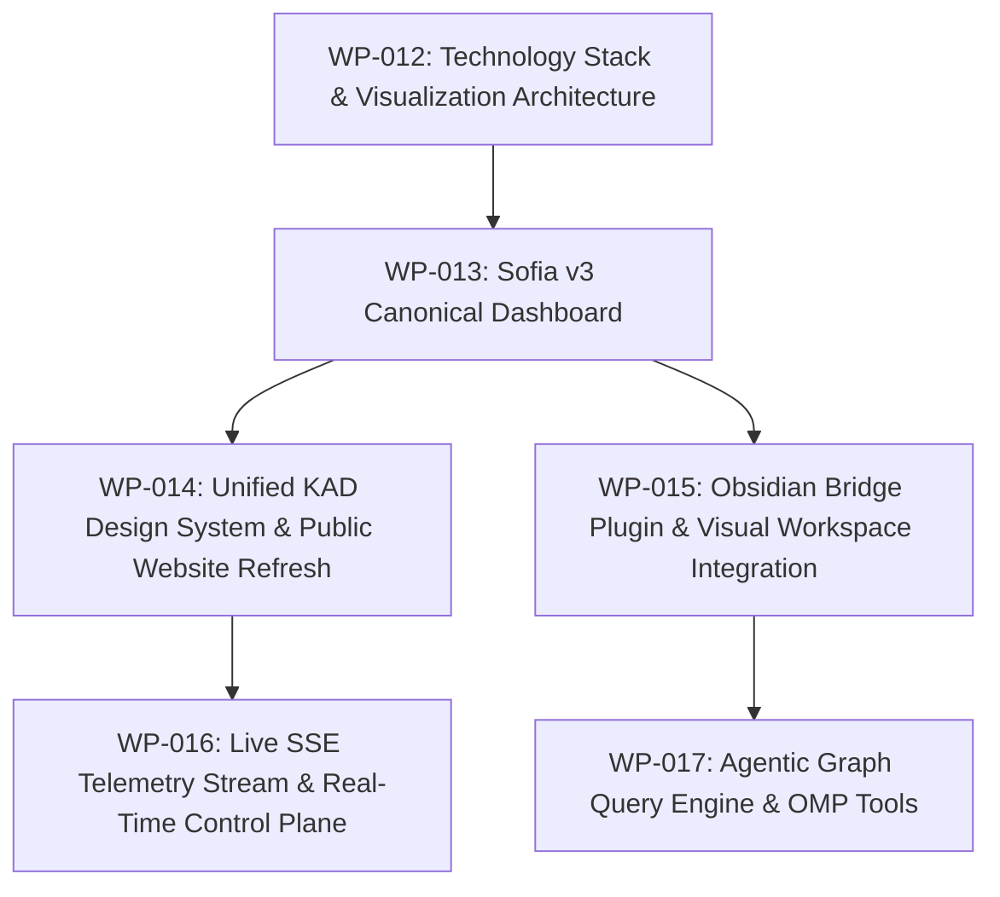

# Next Workpackages Implementation Roadmap (Post-WP-012)

## 1. Workpackage Decomposition & Sequence

Following the establishment of the technology stack and visualization architecture in **WP-012**, implementation proceeds through a sequenced, dependency-ordered set of bounded workpackages:

---

## 2. Workpackage Specifications

### WP-KAD-SOFIA-V3-CANONICAL-DASHBOARD-013 (Priority: 150)
- **Objective**: Upgrade Sofia v3 (`dashboard/`) into a modern, responsive operational dashboard.
- **Key Deliverables**:
  - Connect to compiled `vault/90_Derived/Projections/` data feeds (`sofia-projection.json`, `graph.json`, `projects.json`, `workpackages.json`, `research.json`).
  - Integrate **Cytoscape.js** for interactive project and workpackage graph navigation (pan/zoom, compound layout, typed edge filtering).
  - Integrate **Apache ECharts** for longitudinal token/quota telemetry and counterfactual divergence metrics.
  - Implement resilient offline/stale detection (`applyStaleness`).
  - Zero build step, native ESM architecture.

### WP-KAD-UNIFIED-DESIGN-SYSTEM-AND-WEBSITE-014 (Priority: 140)
- **Objective**: Refine `interface/kad.css` and modernize the public explanatory website (`site/`).
- **Key Deliverables**:
  - Extract modular CSS tokens (`--ink`, `--paper`, `--red`, `--gold`, `--cyan`).
  - Update `site/index.html`, `architecture.html`, `research.html`, and `knowledge.html` with responsive cyberdeck layouts.
  - Retain static-first, GitHub Pages deployability with fail-closed publication filtering.

### WP-KAD-OBSIDIAN-BRIDGE-PLUGIN-015 (Priority: 130)
- **Objective**: Build the small, project-owned read-only Obsidian companion plugin (`kad-obsidian-bridge`).
- **Key Deliverables**:
  - Custom Bases views rendering compiled projection metadata.
  - 1-hop and 2-hop local graph neighborhood view in Obsidian side panel.
  - Zero note mutation; zero network access; 100% graceful degradation.
  - Canary evaluation of Breadcrumbs and Excalidraw plugins.

### WP-KAD-LIVE-TELEMETRY-STREAM-016 (Priority: 120)
- **Objective**: Introduce lightweight Server-Sent Events (SSE) streaming for real-time control plane telemetry.
- **Key Deliverables**:
  - Extend `tools/kad/interface-server.mjs` with `/api/telemetry/stream` (SSE).
  - Stream `kad-telemetry-v1` records to Sofia v3 and desktop widgets without active polling.
  - Automatic graceful fallback to static snapshot when the server is offline.

### WP-KAD-AGENTIC-GRAPH-QUERY-ENGINE-017 (Priority: 110)
- **Objective**: Expose typed graph traversal tools to OMP subagents.
- **Key Deliverables**:
  - CLI `bin/kad graph query` and OMP extension tool for structural graph queries.
  - Pathfinding, dependency resolution, and impact analysis across workpackages and ADRs.
