# Reconciled KAD-PI Workpackage Implementation Roadmap (Post-WP-015 & Post-WP-020)

## 1. Context & Governance Baseline

Following the successful establishment of the **Aesthetic Ideal State Artifact (ISA)** (**WP-015** / ADR 0013), the **Generalized ISA Governance Framework** and **Canonical Compute Fabric ISA** (**WP-020** / ADR 0014), the forward-looking workpackage roadmap has been reconciled against current repository truth.

### Architectural Invariants:
1. **Epistemic State Separation**: Workpackages strictly separate `CANONICAL_TARGET` governance specifications from `CURRENT_CONFIRMED` empirical evidence.
2. **Identifier Preservation**: The reserved identifiers `WP-016`, `WP-017`, `WP-018`, and `WP-019` are preserved with their scopes, dependencies, authority boundaries, and acceptance criteria updated to align with ADR 0014 and the Compute Fabric ISA (`ISA-KAD-COMPUTE-FABRIC-001`).
3. **Authority Isolation**: Presentation layers (Obsidian, Quickshell, Sofia v3, TUI) and transport layers (SSE streaming) are strictly read-only observers of canonical knowledge and telemetry with zero direct mutation authority.
4. **Decoupled Execution**: Workpackages 016..019 and 021 do not form a strict linear chain; they form a modular, parallel-safe execution frontier.

---

## 2. Workpackage Decomposition & Dependency DAG

```mermaid
graph TD
    WP012[WP-012: Technology Stack & Visualization Architecture] --> WP013[WP-013: Sofia v3 Canonical Dashboard]
    WP012 --> WP014[WP-014: Unified Design System & Public Website]
    WP014 --> WP015[WP-015: Aesthetic Directive & Ideal State Artifact]
    WP015 --> WP020[WP-020: Generalized ISA & Compute Fabric Governance]

    WP013 --> WP016[WP-016: Obsidian Bridge Plugin & Visual Workspace]
    WP015 --> WP016
    WP020 --> WP016

    WP014 --> WP017[WP-017: AMDY Omarchy 4 & Quickshell Cyberdeck Theme]
    WP015 --> WP017
    WP020 --> WP017

    WP015 --> WP018[WP-018: TELL Server Monospace ANSI Profile & TUI Hardening]
    WP020 --> WP018

    WP013 --> WP019[WP-019: Live PON/SSE Telemetry Stream & Observer Projection]
    WP020 --> WP019

    WP020 --> WP021[WP-021: Compute Fabric Empirical Benchmark Probe]

    classDef accepted fill:#152b1e,stroke:#4ade80,stroke-width:1px;
    classDef review fill:#2b1d12,stroke:#fbbf24,stroke-width:1px;
    classDef ready fill:#101d2d,stroke:#38bdf8,stroke-width:1px;

    class WP012,WP014 accepted;
    class WP013,WP015,WP020 review;
    class WP016,WP017,WP018,WP019,WP021 ready;
```

---

## 3. Reconciled Workpackage Specifications

### WP-KAD-OBSIDIAN-BRIDGE-PLUGIN-016 (Priority: 150)
- **Objective**: Implement a project-owned, read-only Obsidian companion plugin (`kad-obsidian-bridge`) that renders compiled vault and compute ISA projections, custom Bases views, and local graph neighborhood exploration.
- **Key Deliverables**:
  - Plugin runtime under `tools/kad/obsidian-bridge/` adhering to ESM standards without external bundler lock-in.
  - Custom Bases views consuming compiled `vault/90_Derived/Projections/` data feeds (`projects.json`, `workpackages.json`, `isa-registry.json`, `isa-aesthetic.json`, `isa-compute-fabric.json`).
  - Interactive 1-hop and 2-hop local graph neighborhood sidebar using the renderer-neutral graph adapter.
  - Surface profile `surface.obsidian` compliance (WCAG AAA contrast >14:1, zero ambient motion, `NO_AUDIO_UI`).
  - Zero note mutation; zero network access; 100% offline local-first; graceful degradation on missing projections or disabled plugin.
- **Authority Boundary**: Read-only observer. Zero direct mutation of canonical vault notes or derived JSON projections.

### WP-KAD-AMDY-OMARCHY-CYBERDECK-THEME-017 (Priority: 140)
- **Objective**: Implement the canonical Tier A diegetic cyberdeck presentation layer on developer workstation `amdy` across Omarchy 4 Quattro (Hyprland, Quickshell, Waybar, Terminal) enforcing `ISA-KAD-AESTHETIC-001`.
- **Key Deliverables**:
  - Quickshell / QML / LayerShell theme widgets implementing the Cyberpunk 2077 dataterm + occult clinical bureaucracy aesthetic (`surface.amdy.quickshell`).
  - Hyprland window decorations, borders, and 45-degree polygon chamfers (`surface.amdy.hyprland`).
  - Terminal 24-bit TrueColor profile and color schemes (`surface.terminal.omarchy`).
  - Event-driven 200Hz state transitions (150ms–200ms duration, zero infinite ambient looping animations).
  - WCAG AAA contrast (>14:1) for cyan/bone on dark ink/oxblood background planes.
  - Strict `NO_AUDIO_UI` enforcement across all desktop widgets.
  - Graceful degradation: compositor or GPU failure drops cleanly to 0ms monospace / static rendering.
- **Authority Boundary**: Presentation layer only. Zero authority to directly execute mutating shell commands or alter compute routing.

### WP-KAD-TELL-SERVER-ANSI-PROFILE-018 (Priority: 130)
- **Objective**: Harden the headless server presentation layer on `tell` (NixOS homelab node) with pure 16-color ANSI / 24-bit TrueColor monospace TUI profiles, 0ms latency, zero GUI/audio dependencies, and establish the minimal host capability adapter contract required for compute fabric node discovery.
- **Key Deliverables**:
  - Monospace ANSI 16-color and 24-bit TrueColor palettes for headless server profile (`surface.tell.server`, `KAD_PROFILE_SERVER`).
  - High-density terminal status meters and compact ASCII/ANSI views for system and telemetry state.
  - Host-specific capability adapter contract for `host.tell.server` mapping into canonical capability contracts without leaking NixOS package managers or system paths into cognition policy.
  - Instant 0ms animation overhead and strict `NO_AUDIO_UI` enforcement.
  - Deterministic contrast validation on standard ANSI black/dark backgrounds exceeding 14:1.
  - Headless SSH and multiplexer (tmux/zellij) compatibility with zero X11/Wayland dependencies.
- **Authority Boundary**: Presentation and host-adapter contract only. Zero mutation authority over production routing policy or canonical vault state.

### WP-KAD-LIVE-TELEMETRY-STREAM-019 (Priority: 120)
- **Objective**: Implement lightweight Server-Sent Events (SSE) streaming transport in `tools/kad/interface-server.mjs` (`/api/telemetry/stream`), publishing typed PON state transition notifications and normalized `kad-telemetry-v1` records to read-only observers with strict authority boundary enforcement.
- **Key Deliverables**:
  - Lightweight SSE streaming endpoint at `/api/telemetry/stream` in `tools/kad/interface-server.mjs`.
  - Event producer publishing typed PON state transition notifications (`NODE_AVAILABLE`, `MODEL_READY`, `CAPABILITY_REMOVED`, `ROUTE_STALE`, `QUOTA_REFRESHED`) and normalized `kad-telemetry-v1` records.
  - Monotonically increasing sequence IDs, event typing, and keep-alive heartbeats.
  - Client subscription handlers with automatic reconnect, backpressure handling, and graceful fallback to static `/api/runtime-status` polling.
  - Strict read-only outbound invariant: zero write routes or incoming control mutation over SSE transport.
- **Authority Boundary**: Outbound telemetry transport only. Zero incoming control or mutation authority.

### WP-KAD-COMPUTE-FABRIC-EXPERIMENTAL-PROBE-021 (Priority: 160)
- **Objective**: Implement the first deterministic empirical benchmark probe runner for the 9-dimensional experimental tuple on `amdy` (local ROCm / `amdgpu_top`) and compile measured baseline telemetry receipts into `evidence/`.
- **Key Deliverables**:
  - Probe runner exercising local ROCm inference configurations across context lengths, quantizations, and batch sizes.
  - Empirical telemetry capture across all 11 metrics specified in `ISA-KAD-COMPUTE-FABRIC-001`.
  - Append-only empirical receipts journal with hash chaining and deterministic export.
  - Promotion readiness evaluation based on measured local baseline evidence.
- **Authority Boundary**: Empirical measurement and evidence recording. Zero production routing mutation without passing through readiness promotion gates.

---

## 4. Dependency DAG & Execution Order

| Workpackage | Status | Dependencies | Execution Frontier | Parallelism |
|---|---|---|---|---|
| **WP-016** (Obsidian Bridge) | `PROPOSED` | WP-013, WP-014, WP-015, WP-020 | `CAN_EXECUTE_NOW` | `PARALLEL_SAFE` with 017, 018, 019, 021 |
| **WP-017** (AMDY Omarchy) | `PROPOSED` | WP-014, WP-015, WP-020 | `CAN_EXECUTE_NOW` | `PARALLEL_SAFE` with 016, 018, 019, 021 |
| **WP-018** (TELL Server) | `PROPOSED` | WP-015, WP-020 | `CAN_EXECUTE_NOW` | `PARALLEL_SAFE` with 016, 017, 019, 021 |
| **WP-019** (Live SSE Stream) | `PROPOSED` | WP-002, WP-004, WP-013, WP-020 | `CAN_EXECUTE_NOW` | `PARALLEL_SAFE` with 016, 017, 018, 021 |
| **WP-021** (Empirical Probe) | `PROPOSED` | WP-004, WP-005, WP-020 | `CAN_EXECUTE_NOW` | `PARALLEL_SAFE` with 016, 017, 018, 019 |

---

## 5. ISA Alignment Matrix

| Invariant | WP-016 (Obsidian) | WP-017 (AMDY Omarchy) | WP-018 (TELL Server) | WP-019 (Live SSE) | WP-021 (Empirical Probe) | Rationale |
|---|---|---|---|---|---|---|
| **PON Directives** | `RELEVANT` | `RELEVANT` | `RELEVANT` | `REQUIRED` | `REQUIRED` | WP-019 is the core transport broadcasting typed PON notifications; WP-021 measures notification overhead; others react to events. |
| **STC Spatial** | `RELEVANT` | `RELEVANT` | `REQUIRED` | `RELEVANT` | `REQUIRED` | WP-018 defines the `host.tell.server` capability contract; WP-021 exercises local hardware capability limits. |
| **STC Temporal** | `RELEVANT` | `RELEVANT` | `RELEVANT` | `REQUIRED` | `REQUIRED` | WP-019 manages client subscription lifecycles; WP-021 enforces LIFO teardown of benchmark runtimes and VRAM reservations. |
| **TDD Directives** | `REQUIRED` | `REQUIRED` | `REQUIRED` | `REQUIRED` | `REQUIRED` | All packages require deterministic contract tests and automated validation before acceptance. |
| **Graceful Degradation** | `REQUIRED` | `REQUIRED` | `REQUIRED` | `REQUIRED` | `REQUIRED` | All presentation surfaces fall back to raw text/monospace; SSE falls back to static snapshot polling; probe fails closed. |
| **TOKENMAXXING** | `RELEVANT` | `RELEVANT` | `RELEVANT` | `REQUIRED` | `REQUIRED` | SSE pushes diffs to avoid polling token/CPU waste; WP-021 measures objective $\frac{\text{work}}{\text{scarce resources}}$. |
| **Authority Separation** | `REQUIRED` | `REQUIRED` | `REQUIRED` | `REQUIRED` | `REQUIRED` | Presentation and transport layers have zero authority to mutate canonical vault or production compute routing state. |
| **Local-First** | `REQUIRED` | `REQUIRED` | `REQUIRED` | `REQUIRED` | `REQUIRED` | All packages operate 100% offline with zero external cloud or CDN dependencies. |
| **Renderer Neutrality** | `RELEVANT` | `RELEVANT` | `RELEVANT` | `RELEVANT` | `NOT_APPLICABLE` | Design tokens in `ISA-KAD-AESTHETIC-001` project into CSS, QML, and ANSI without altering semantic meaning. |
| **Epistemic Honesty** | `REQUIRED` | `REQUIRED` | `REQUIRED` | `REQUIRED` | `REQUIRED` | 3-tier authority and 4-way redundant visual encoding strictly enforced across all surfaces and telemetry. |

---

## 6. Authority Matrix

| Workpackage | May Read | May Derive | May Render | May Propose | May Mutate | Must Never Mutate |
|---|---|---|---|---|---|---|
| **WP-016** (Obsidian Bridge) | `vault/90_Derived/Projections/`, `vault/00_Governance/`, `vault/*.md` | Local graph views, filtered Bases tables | Obsidian sidebar, Bases views, local Cytoscape graph | Markdown link suggestions, frontmatter patches | Plugin local cache / settings | Canonical vault notes directly, derived JSON projections, routing state |
| **WP-017** (AMDY Omarchy) | `vault/90_Derived/Projections/isa-aesthetic.json`, `interface/tokens.css` | Desktop theme variables, QML bindings | Hyprland borders, Quickshell HUD, terminal styling | Desktop state notifications | Local desktop theme files (`~/.config/` exports) | Canonical vault, compute routing policy, execute raw shell commands |
| **WP-018** (TELL Server) | `vault/90_Derived/Projections/`, terminal capabilities | Monospace TUI layouts, ANSI color maps | Headless ANSI/TrueColor TUI, status meters | Host capability descriptor (`tell`) | Local terminal profile configuration | Production routing policy, canonical vault, remote machine OS state |
| **WP-019** (Live SSE Stream) | `tools/kad/telemetry/`, PON notification bus, `vault/90_Derived/Projections/` | SSE event frames (`text/event-stream`) | Real-time outbound data stream | Real-time status updates to clients | Ephemeral connection registry in memory | Canonical vault, production routing authority, grant inbound write control |
| **WP-021** (Empirical Probe) | `tools/kad/`, GPU metrics (`amdgpu_top`), model store | 9-tuple experimental benchmarks, telemetry metrics | Benchmark progress bars, tabular receipts | Route promotion recommendations | Append-only evidence receipts under `evidence/` | Production routing policy, canonical vault, execute unverified routes |

---

## 7. Historical Lineage & Identifier Preservation

1. **WP-015**: Originally proposed for Obsidian Bridge Plugin during the WP-012/013 era; formally claimed, executed, and accepted as the **Aesthetic Directive & Ideal State Artifact (ISA)** establishing ADR 0013 and `ISA-KAD-AESTHETIC-001`.
2. **WP-016**: Shifted from live telemetry to **Obsidian Bridge Plugin & Governed Visual Workspace Integration** following WP-015.
3. **WP-017**: Reconciled as **AMDY Omarchy 4 Quattro & Quickshell KAD Cyberdeck Theme Implementation** following ADR 0013 and `ISA-KAD-AESTHETIC-001`.
4. **WP-018**: Reconciled as **TELL Server Monospace ANSI Profile, Headless TUI & Host Observability Baseline** separating presentation hardening from distributed compute benchmark execution.
5. **WP-019**: Reconciled as **Live PON/SSE Telemetry Streaming Transport & Read-Only Observer Projection** strictly separating outbound event broadcasting from inbound control authority.
6. **WP-020**: Claimed, executed, and verified as **Generalized ISA Governance Framework & Canonical Compute Fabric ISA** establishing ADR 0014, multi-domain ISA validation, and `ISA-KAD-COMPUTE-FABRIC-001`.
7. **WP-021**: Recommended as the next empirical compute fabric increment (**Compute Fabric Empirical Benchmark Probe**).
