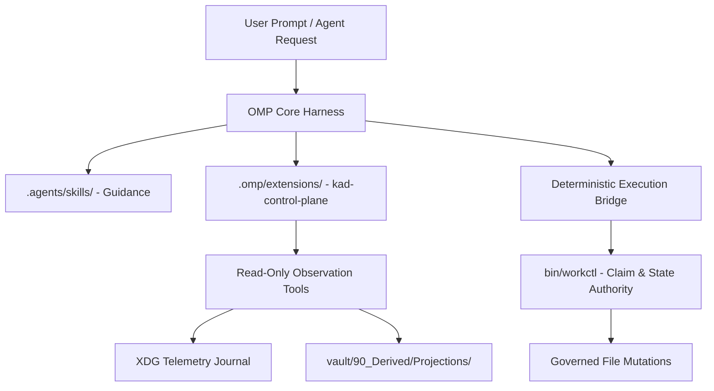

# OMP Tooling & Extension Decision Matrix

## 1. Extension & Skill Governance Principles
1. **Project-Scoped by Default**: All KAD capabilities, custom extensions, and MCP configs reside in the repository (`.omp/`, `.agents/skills/`).
2. **Authority Separation**:
   - Skills guide workflows and prompt decomposition.
   - Extension tools expose read-only inspection and candidate proposals.
   - `workctl` and deterministic KAD CLIs authorize mutations and state transitions.
3. **Model Independence**: Configurations use abstract model roles (`@plan`, `@task`, `@verifier`, `@research`, `@smol`, `@world`, `@local_retrieval`) with zero vendor hardcoding.

---

## 2. Tooling & Plugin Evaluation Matrix

| Component | Scope / Type | Purpose | Security & Privacy | Decision | Justification |
|---|---|---|---|---|---|
| **`kad-control-plane.js`** | Project Extension (`.omp/extensions/`) | Exposes compact telemetry meter, GPU stats, and status bar | Pure local IPC / amdgpu_top / in-memory | **KEEP** | Native project extension implementing real-time operator HUD. |
| **`kad-context-economy.js`** | Project Extension (`.omp/extensions/`) | Automatic token compaction and checkpoint receipts | Local deterministic hashing / snapcompact | **KEEP** | Essential for context window management during complex agent tasks. |
| **`context7` MCP** | Project MCP (`.omp/mcp.json`) | Library and API documentation query tool | Project-scoped; credential-free; Upstash MCP | **KEEP** | Provides real-time documentation retrieval for external libraries. |
| **KAD Wayfinder Skill** | Project Skill (`.agents/skills/`) | Multi-perspective decision framework and option analysis | Pure prompt guidance / zero code mutation | **KEEP** | Reusable decision-making engine. |
| **KAD Workspace Skills** | Project Skills (`.agents/skills/`) | `workspace-orient`, `workspace-pick-work`, `workspace-finish`, etc. | Bound to `bin/workctl` | **KEEP** | Standardized workpackage lifecycle. |
| **Frontend Design Marketplace Plugin** | Marketplace Plugin | UI component scaffolding | Audited for Claude-specific prompts | **ADAPT_AS_SKILL** | Extract UI design patterns into `.agents/skills/designer/` rather than installing global package. |
| **Security Guidance Marketplace Plugin** | Marketplace Plugin | Static vulnerability analysis | Local shellcheck/trivy/gitleaks wrappers | **ADAPT_AS_SKILL** | KAD already enforces deterministic tools via `kad doctor` and `prek`; integrate as skills. |
| **Code Review Marketplace Plugin** | Marketplace Plugin | Multi-agent PR review toolkit | Checks for diffs and standards | **ADAPT_AS_SKILL** | Maintain as project skill `.agents/skills/code-review/` with verifier model binding. |

---

## 3. Extension Architecture Specification

