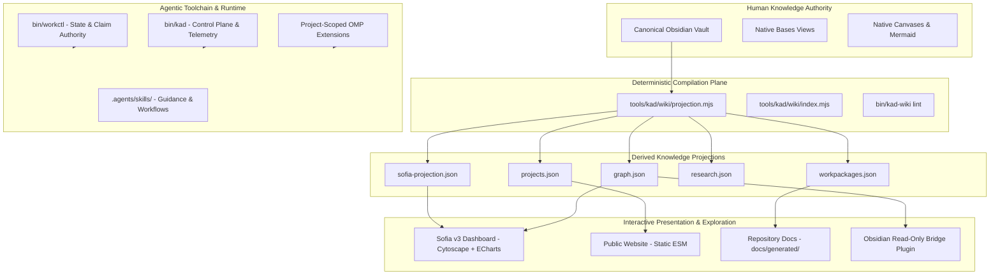

# Target Technology Architecture — KAD-PI Platform

## 1. System Overview

KAD-PI is an evidence-gated, deterministic-first sovereign knowledge and agent governance platform. The target architecture establishes a clean, decoupled hierarchy where human authority, deterministic compilation, interactive visualization, and agent toolchains operate with clear boundaries.

---

## 2. Layer Specifications

### Layer 1: Knowledge Authority Plane
- **Technology**: Markdown files with strictly typed YAML frontmatter in `vault/`.
- **Governance**: Governed zones (`00_Governance/`, `50_Projects/`, etc.) validated by `PROPERTY_REGISTRY.md`.
- **Tooling**: Obsidian Core (Properties, Bases, Canvas, Graph, Mermaid).

### Layer 2: Projection & Derivation Plane
- **Technology**: Node.js Native ESM (`tools/kad/wiki/projection.mjs`).
- **Trigger**: Executed via `./bin/kad-wiki rebuild` on demand or during test suites.
- **Output**: JSON feeds under `vault/90_Derived/Projections/` and markdown files under `docs/generated/`.

### Layer 3: Presentation & Visualization Plane
- **Sofia v3 Dashboard**:
  - Runtime: Vanilla ESM + HTML5 + `interface/kad.css`.
  - Graph Engine: **Cytoscape.js** (Core layouts + Dagre extension).
  - Chart Engine: **Apache ECharts** (Modular time-series & distribution charts) + Native CSS meters.
- **Public Website**:
  - Runtime: Static HTML/ESM on GitHub Pages.
  - Data: Consumes `site/generated/public-state.json` with fail-closed publication filtering.
- **Obsidian Integration**:
  - `kad-obsidian-bridge`: Lightweight read-only plugin for custom Bases and telemetry sidecars.

### Layer 4: Control Plane & Agentic Execution
- **Workpackage Lifecycle**: `workctl` manages claims, transitions, and state isolation.
- **Telemetry Plane**: Append-only tamper-evident journal under XDG state (`tools/kad/telemetry/`).
- **OMP Harness Integration**: Project-scoped ExtensionAPI (`.omp/extensions/kad-control-plane.js`) and project skills (`.agents/skills/`).
