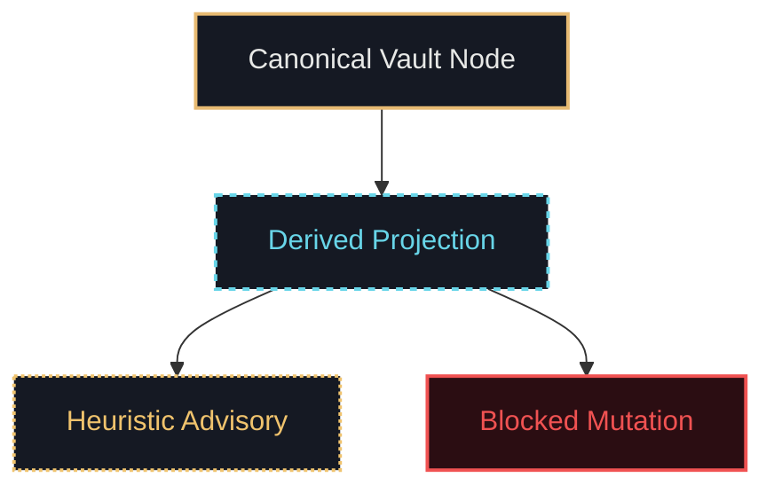

# Documentation Aesthetic Directive - WP-KAD-AESTHETIC-DIRECTIVE-AND-IDEAL-STATE-ARTIFACT-015

## 1. Documentation Scope & Tier B Rules
Per accepted **Decision 2 (Two-Tier Stratification)**, all documentation, ADRs, research papers, and public GitHub surfaces operate under **Tier B (Restrained Scientific & Governance Literature)**.

---

## 2. Markdown & Typographic Standards
- **Headings**: Semantic `# H1` through `#### H4` hierarchy without skips. Headings may use numbered prefixes for formal sections (`## 1. Scope`).
- **Callouts**: Standard blockquotes with uppercase classification chips:
  - `> **INVARIANT**: Inviolable rule.`
  - `> **WARNING**: Degraded or high-risk state.`
  - `> **NOTE**: Informational context.`
- **Tables**: Markdown tables with clean alignment, explicit column headers, and normalized casing (e.g. `PASS`, `FAIL`, `CANONICAL`, `UNKNOWN`).
- **Code & Syntax Blocks**: Explicit language tags (`json`, `mjs`, `bash`, `text`, `yaml`, `mermaid`).

---

## 3. Mermaid & Architecture Diagram Conventions
All architectural diagrams must follow standardized semantic node styling:

- **Canonical Authorities**: Gold solid stroke (`stroke:#e7ba72, stroke-width:2px`).
- **Derived Projections**: Cyan dashed stroke (`stroke:#68d5e8, stroke-dasharray: 4 4`).
- **Heuristic Suggestions**: Amber dotted stroke (`stroke:#f0c36d, stroke-dasharray: 2 2`).
- **Errors & Blockers**: Red stroke / dark crimson fill (`fill:#2b0d12, stroke:#f05252`).

---

## 4. Public GitHub & README Governance
1. **Clarity Over Diegesis**: Technical descriptions must be grounded in actual software behavior (e.g. "evidence-gated local AI research platform", not "Gnostic daemon invocation system").
2. **Zero Fictional Lore Jargon in Production Docs**: Terms like *Demiurge*, *Mar Psíquico*, or *Khayn* are strictly confined to narrative/worldbuilding files (`kad-rpg/`) and must not appear in technical installation guides or public README files.
