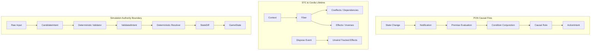

# KAD Domain Taxonomy & Semantic Ontology

**Status:** Canonical Machine & Agent Vocabulary  
**Version:** 1.0.0

This taxonomy defines the formal ontological structure of concepts across the KAD ecosystem.

---

## 1. Domains Overview

1. **`PON_STC_CORE`**: Notification-Oriented Paradigm (PON) causal execution, Spatiotemporal Composability (STC), and Cordis runtime.
2. **`KAD_SIMULATION`**: Authority boundaries, intent validation, deterministic resolution, and world simulation.
3. **`PI_INTEGRATION`**: Pi Coding Agent SDK lifecycle seams, subscription mechanics, and non-mutation invariants.
4. **`SWARM_GOVERNANCE`**: AGY subagent roles (`kad-master`, `kad-researcher`, `kad-builder`, `kad-tester`, `kad-reviewer`), delegation boundaries, and STOP conditions.
5. **`SUBSCRIPTION_ECONOMICS`**: Quota pools across ChatGPT Plus, Google AI Pro, and OpenCode Go, token efficiency, and routing.
6. **`SAFE_LAB_TOOLCHAINS`**: DeepSeek Harness (`dsh`) plugin lab, Dream OS, and QuickShell UI customization.
7. **`EPISTEMOLOGY_EVIDENCE`**: Prime Directive constitution, reality levels (`STATIC`, `SIMULATED`, `INTEGRATION`, `LIVE_OBSERVED`), and claim ledgers.

---

## 2. Core Concept Graph

